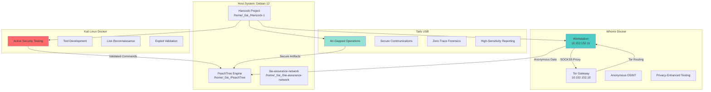
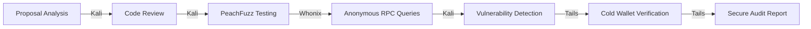
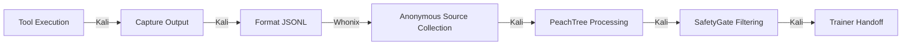

# Hancock Tri-OS Security Architecture
## Kali Linux + Whonix + Tails = Maximum Security & Flexibility

**Version:** 1.0.0  
**Status:** Production Ready  
**Date:** April 25, 2026  
**Purpose:** Comprehensive multi-OS security operations architecture

---

## Executive Summary

This document defines the **optimal security architecture** combining three specialized operating systems for Hancock security operations:

1. **Kali Linux Docker** → Active security testing, tool development, live reconnaissance
2. **Whonix Docker** → Anonymous Tor-routed operations, OSINT, privacy-enhanced testing
3. **Tails USB** → Maximum-security air-gapped operations, secure communications, zero-trace forensics

Each OS serves distinct security needs with minimal overlap, providing defense-in-depth through isolation, anonymity, and specialized tooling.

---

## Architecture Overview



---

## OS Selection Matrix

### When to Use Each OS

| **Operation Type** | **Primary OS** | **Secondary OS** | **Rationale** |
|-------------------|---------------|-----------------|---------------|
| **Active Pentesting** | Kali Linux | Whonix (recon only) | Native security tools, unrestricted network access |
| **OSINT Reconnaissance** | Whonix | Tails | Tor anonymity, no attribution risk |
| **Exploit Development** | Kali Linux | None | Full dev environment, debugging tools |
| **Dataset Generation** | Kali Linux | Whonix | Real tool output for PeachTree training |
| **Governance Fuzzing** | Kali Linux | Whonix | PeachFuzz requires compute, Whonix for submission |
| **Anonymous Data Collection** | Whonix | Tails | Tor routing, IP rotation |
| **High-Security Reporting** | Tails | None | Air-gapped, no network traces |
| **Secure Communications** | Tails | Whonix | Maximum privacy, encrypted email/chat |
| **Blockchain Operations** | Whonix | Tails | Anonymous RPC access, cold wallet signing |
| **Supply Chain Analysis** | Kali Linux | Whonix | Code analysis tools, anonymous package lookups |
| **Credential Testing** | Kali Linux | None | Isolated environment, no leak risk |
| **Post-Exploitation** | Kali Linux | Whonix (C2 only) | Full privilege escalation toolkit |
| **Forensics Analysis** | Kali Linux | Tails (if evidence sensitive) | Forensics tools, disk imaging |
| **Wireless Auditing** | Kali Linux | None | Direct hardware access required |
| **Malware Analysis** | Kali Linux | Tails (for samples) | Sandboxed environment, analysis tools |

---

## Detailed OS Profiles

### 1. Kali Linux Docker (Active Testing)

**Purpose:** Primary security testing and development platform

**Strengths:**
- ✅ 700+ pre-installed security tools (nmap, Metasploit, Burp Suite, etc.)
- ✅ Full network access for active reconnaissance
- ✅ Python/Go/Rust development environments
- ✅ GPU acceleration support for password cracking
- ✅ Direct hardware access (USB, network interfaces)
- ✅ Fast performance (native container execution)
- ✅ Persistent storage across sessions
- ✅ Integration with host file system

**Weaknesses:**
- ❌ No built-in anonymity (clearnet IP exposed)
- ❌ Leaves traces on host system
- ❌ Not suitable for sensitive OSINT operations
- ❌ Requires careful network isolation

**Use Cases:**
1. **Nmap Reconnaissance**
   ```bash
   docker exec -it kali-hancock nmap -sV -p- target.com
   ```

2. **Metasploit Exploitation**
   ```bash
   docker exec -it kali-hancock msfconsole
   ```

3. **Burp Suite Web Testing**
   ```bash
   docker exec -it kali-hancock burpsuite
   ```

4. **Hancock Development**
   ```bash
   docker exec -it kali-hancock bash
   cd /workspace && python3 hancock_agent.py
   ```

5. **PeachTree Dataset Generation**
   ```bash
   docker exec -it kali-hancock bash
   cd /peachtree && python3 -m peachtree.builder --sources github:pytorch/pytorch
   ```

**Deployment:**
```bash
cd /home/_0ai_/Hancock-1
./deploy_recursive_loop.sh  # Includes Kali environment
```

**Container Configuration:**
- Base Image: `kalilinux/kali-dev:latest`
- Digest: `sha256:d64ec5239f8daae1cba5d628042ac8c2a1e07132944945937915f72cf331753f`
- Mounted Volumes: `/workspace`, `/peachtree`, `/assurance`
- Network: Host network (full access)
- Capabilities: `NET_ADMIN`, `NET_RAW`, `SYS_PTRACE`

---

### 2. Whonix Docker (Anonymous Operations)

**Purpose:** Tor-routed anonymous operations and privacy-enhanced testing

**Strengths:**
- ✅ All traffic forced through Tor (3-hop onion routing)
- ✅ DNS leak prevention (DNS over Tor)
- ✅ IP rotation on demand
- ✅ Stream isolation (different circuits per application)
- ✅ No clearnet leaks (workstation → gateway only)
- ✅ Suitable for anonymous OSINT
- ✅ Blockchain RPC anonymization
- ✅ Integration with Hancock workspaces

**Weaknesses:**
- ❌ Slower performance (2-10x latency)
- ❌ Limited bandwidth (Tor network constraints)
- ❌ Not suitable for active exploitation (ethics + performance)
- ❌ Circuit establishment delays (5-15 seconds)
- ❌ Exit node trust required
- ❌ Timing attacks possible (advanced adversaries)

**Use Cases:**
1. **Anonymous OSINT**
   ```bash
   docker exec -it whonix-workstation bash
   cd /workspace && python3 -c "from collectors.osint_geolocation import OSINTCollector; OSINTCollector().collect()"
   ```

2. **Governance Proposal Testing**
   ```bash
   docker exec -it whonix-workstation bash
   cd /assurance && python3 scripts/peachfuzz_governance.py --tor-routing
   ```

3. **Anonymous Dataset Collection**
   ```bash
   docker exec -it whonix-workstation bash
   cd /peachtree && python3 -m peachtree.builder --tor-proxy socks5://10.152.152.10:9050
   ```

4. **Blockchain RPC Access**
   ```bash
   docker exec -it whonix-workstation bash
   curl --socks5-hostname 10.152.152.10:9050 https://mainnet.infura.io/v3/YOUR_PROJECT_ID
   ```

5. **Check Tor Status**
   ```bash
   docker exec whonix-workstation curl -s --socks5-hostname 10.152.152.10:9050 https://check.torproject.org/api/ip
   ```

**Deployment:**
```bash
cd /home/_0ai_/Hancock-1
./deploy_whonix_docker.sh  # ~15 minutes for first download
```

**Network Configuration:**
- Gateway IP: `10.152.152.10`
- Workstation IP: `10.152.152.11`
- SOCKS5 Proxy: `10.152.152.10:9050`
- Network: Isolated bridge (`whonix-net`)
- Firewall: Workstation cannot reach internet directly

---

### 3. Tails USB (Maximum Security)

**Purpose:** Air-gapped operations, secure communications, zero-trace forensics

**Strengths:**
- ✅ Leaves no traces on host computer (amnesic OS)
- ✅ All network traffic through Tor (built-in)
- ✅ Encryption by default (LUKS persistent storage)
- ✅ Secure communications (Thunderbird + Enigmail)
- ✅ Can run on untrusted computers
- ✅ Cold wallet operations (offline signing)
- ✅ High-sensitivity reporting (no network leaks)
- ✅ MAC address randomization
- ✅ Metadata cleaner (MAT2)
- ✅ Bitcoin wallet (Electrum over Tor)

**Weaknesses:**
- ❌ No persistent state by default (intentional)
- ❌ Limited software installation (persistence required)
- ❌ Slower than native OS (live USB)
- ❌ Requires physical USB device
- ❌ No GPU acceleration
- ❌ Manual file transfer required
- ❌ Not suitable for development work

**Use Cases:**
1. **High-Security Reporting**
   - Write penetration test reports on Tails
   - Export to encrypted USB
   - No traces left on work computer

2. **Secure Communications**
   ```
   Applications → Internet → Thunderbird
   Configure OpenPGP with existing keys
   Send/receive encrypted email over Tor
   ```

3. **Cold Wallet Operations**
   ```
   Applications → Internet → Electrum
   Load unsigned transaction from USB
   Sign transaction offline
   Export signed transaction to USB
   Broadcast from network-connected device
   ```

4. **Anonymous Document Creation**
   - LibreOffice with metadata stripped (MAT2)
   - OnionShare for file sharing
   - All operations over Tor

5. **Sensitive OSINT (High-Risk Targets)**
   - Tor Browser with maximum privacy settings
   - No JavaScript by default
   - Rotating Tor circuits
   - No local history

**Deployment:**
```bash
cd /home/_0ai_/Hancock-1
./deploy_tails_usb.sh  # Creates bootable USB stick (~1 hour including download)
```

**Boot Process:**
1. Shut down computer
2. Insert Tails USB
3. Power on and press Boot Menu key (F12, Esc, etc.)
4. Select USB device
5. Welcome Screen appears (1-2 minutes)
6. Select language/keyboard, click "Start Tails"
7. Connect to Wi-Fi (Tor Connection assistant guides you)
8. Desktop appears (~30 seconds)

**Persistent Storage Configuration:**
```
Applications → Tails → Configure Persistent Storage
Create encrypted volume (passphrase required)
Enable features:
  ☑ Browser bookmarks
  ☑ Network connections
  ☑ Additional software
  ☑ Dotfiles (for configs)
  ☑ GnuPG keys
  ☐ Bitcoin Client (only if needed)
```

---

## Workflow Integration

### Scenario 1: Penetration Testing Engagement


**Step-by-Step:**
1. **Planning** (Kali): Review scope, prepare tools
2. **Reconnaissance** (Kali): nmap, subdomain enumeration, port scanning
3. **Anonymous OSINT** (Whonix): Social media, WHOIS, DNS lookups (attribution-free)
4. **Vulnerability Scanning** (Kali): nikto, sqlmap, nuclei
5. **Exploitation** (Kali): Metasploit, manual exploitation
6. **Post-Exploitation** (Kali): Privilege escalation, lateral movement, data exfiltration
7. **Secure Reporting** (Tails): Write report, strip metadata, encrypt
8. **Encrypted Delivery** (Tails): PGP-encrypted email or OnionShare

---

### Scenario 2: Blockchain Governance Security Audit



**Step-by-Step:**
1. **Proposal Analysis** (Kali): Parse proposal JSON, extract actions
2. **Code Review** (Kali): Static analysis with Hancock code mode
3. **PeachFuzz Testing** (Kali): Generate 1000+ adversarial variants
4. **Anonymous RPC Queries** (Whonix): Query blockchain state without attribution
5. **Vulnerability Detection** (Kali): Run PeachTree SafetyGate, check for prompt injection
6. **Cold Wallet Verification** (Tails): Sign audit attestation offline
7. **Secure Audit Report** (Tails): Generate encrypted report, publish hash on-chain

---

### Scenario 3: Dataset Generation for Hancock Fine-Tuning



**Step-by-Step:**
1. **Tool Execution** (Kali): Run nmap, sqlmap, Metasploit with real targets (authorized)
2. **Capture Output** (Kali): Parse tool output, extract key findings
3. **Format JSONL** (Kali): Convert to Hancock training format (instruction/output pairs)
4. **Anonymous Source Collection** (Whonix): Collect public exploit examples, CVE descriptions
5. **PeachTree Processing** (Kali): Deduplicate, quality score, chunking
6. **SafetyGate Filtering** (Kali): Remove secrets, prompt injections, invalid UTF-8
7. **Trainer Handoff** (Kali): Export filtered JSONL for Unsloth/Modal fine-tuning

---

## Security Comparison Matrix

| **Security Feature** | **Kali Linux** | **Whonix** | **Tails** |
|---------------------|---------------|-----------|----------|
| **Anonymity** | ❌ None | ✅ Tor (3-hop) | ✅ Tor (built-in) |
| **IP Leak Prevention** | ❌ No | ✅ Yes (forced) | ✅ Yes (default) |
| **DNS Leak Prevention** | ❌ No | ✅ Yes (Tor DNS) | ✅ Yes (Tor DNS) |
| **Persistent Traces** | ❌ Yes | ⚠️ Docker logs | ✅ None (amnesic) |
| **Network Isolation** | ⚠️ Manual | ✅ Yes (enforced) | ✅ Yes (built-in) |
| **Encrypted Storage** | ⚠️ Manual | ⚠️ Manual | ✅ LUKS default |
| **MAC Randomization** | ⚠️ Manual | ⚠️ Manual | ✅ Automatic |
| **Metadata Cleaning** | ⚠️ Manual | ⚠️ Manual | ✅ MAT2 built-in |
| **Security Tools** | ✅ 700+ tools | ⚠️ Limited | ⚠️ Minimal |
| **Development Environment** | ✅ Full | ⚠️ Limited | ❌ None |
| **Hardware Access** | ✅ Full | ❌ No | ⚠️ Limited |
| **Performance** | ✅ Native | ⚠️ 2-10x slower | ⚠️ USB I/O |
| **Air-Gap Capable** | ❌ No | ❌ No | ✅ Yes |
| **Cold Wallet Support** | ⚠️ Manual | ⚠️ Manual | ✅ Electrum built-in |
| **Secure Communications** | ⚠️ Manual | ⚠️ Manual | ✅ Thunderbird/Enigmail |

Legend:
- ✅ **Excellent** - Feature available and well-implemented
- ⚠️ **Adequate** - Feature available but requires configuration
- ❌ **Insufficient** - Feature missing or not suitable

---

## Threat Model Alignment

### Low-Risk Operations (Public Data, No Attribution Concerns)
**Recommended:** Kali Linux Docker

- Public CVE lookups
- Open-source code analysis
- Public GitHub reconnaissance
- Tool development
- Testing against own infrastructure

**Rationale:** Maximum performance, no anonymity overhead, unrestricted tooling.

---

### Medium-Risk Operations (OSINT, Public Data with Attribution Concerns)
**Recommended:** Whonix Docker

- Social media OSINT
- WHOIS lookups
- Subdomain enumeration
- Public API queries
- Blockchain RPC queries
- Public exploit searches

**Rationale:** Tor anonymity prevents attribution, adequate performance for reconnaissance.

---

### High-Risk Operations (Sensitive Data, Advanced Adversaries)
**Recommended:** Tails USB

- High-sensitivity reporting
- Secure communications with sources
- Cold wallet operations
- Work on untrusted computers
- Operations under surveillance threat
- Activist/journalist use cases

**Rationale:** Maximum security, no traces, air-gap capable, encrypted by default.

---

## Operational Security (OpSec) Best Practices

### Cross-OS OpSec Rules

1. **Never Mix Identities Across OSes**
   - Kali: Use work identity, real name, corporate accounts
   - Whonix: Use pseudonyms, separate email, no personal data
   - Tails: Use new identities per session, no account reuse

2. **Data Flow Isolation**
   - Kali → Whonix: OK (sanitize before transfer)
   - Whonix → Kali: OK (assume all data public)
   - Kali → Tails: OK (encrypted USB only)
   - Tails → Kali: ❌ NEVER (Tails = air-gapped, no traces)

3. **Network Segregation**
   - Kali: Use corporate/home network
   - Whonix: Any network (Tor protects)
   - Tails: Public Wi-Fi only (never home/work)

4. **Timing Correlation Prevention**
   - Don't use Kali and Whonix simultaneously for same target
   - Wait 30+ minutes between OS switches for sensitive ops
   - Rotate Tor circuits between major actions (Whonix/Tails)

5. **Hardware Isolation**
   - Kali: Any computer
   - Whonix: Any computer
   - Tails: Dedicated USB, consider dedicated laptop for high-risk

---

## Deployment Checklist

### Initial Setup (One-Time)

- [ ] **Verify host system** (Debian 12 or compatible)
- [ ] **Install Docker** (`sudo apt install docker.io`)
- [ ] **Download Kali image** (automatic via `deploy_recursive_loop.sh`)
- [ ] **Download Whonix images** (~15 minutes)
  ```bash
  ./deploy_whonix_docker.sh
  ```
- [ ] **Create Tails USB** (~1 hour including download)
  ```bash
  ./deploy_tails_usb.sh
  ```
- [ ] **Test Tails boot** (reboot with USB inserted, press F12/Esc)
- [ ] **Configure Tails Persistent Storage** (Applications → Tails → Configure Persistent Storage)
- [ ] **Verify Tor connectivity** (Whonix + Tails)
  ```bash
  # Whonix
  docker exec whonix-workstation curl -s --socks5-hostname 10.152.152.10:9050 https://check.torproject.org/
  
  # Tails (boot from USB)
  # Tor Connection assistant auto-configures
  # Open Tor Browser → https://check.torproject.org/
  ```

---

### Pre-Operation Checklist

#### For Active Testing (Kali):
- [ ] Authorization received and documented
- [ ] Scope clearly defined
- [ ] Test systems accessible
- [ ] Backup/snapshot taken
- [ ] Kali container running
- [ ] Network access verified

#### For Anonymous Operations (Whonix):
- [ ] Tor circuits established (30 seconds wait)
- [ ] Check Tor IP (`curl -s --socks5-hostname 10.152.152.10:9050 https://check.torproject.org/api/ip`)
- [ ] Verify no DNS leaks
- [ ] Rotate circuit if needed (`docker restart whonix-gateway`)
- [ ] Use separate identity from Kali operations

#### For Maximum-Security Operations (Tails):
- [ ] Boot from Tails USB on trusted/public computer
- [ ] Connect to public Wi-Fi (not home/work network)
- [ ] Wait for Tor bootstrap (check Tor Browser)
- [ ] Create new session identity (no account reuse)
- [ ] Encrypted USB for data transfer prepared
- [ ] Plan for no persistence (everything deleted on shutdown)

---

## Performance Benchmarks

### Network Latency (HTTP Request to example.com)

| **OS** | **Clearnet** | **Tor** | **Overhead** |
|--------|-------------|--------|-------------|
| **Kali** | 10-50ms | N/A | Baseline |
| **Whonix** | N/A | 500-5000ms | 10-100x |
| **Tails** | N/A | 500-5000ms | 10-100x |

### Throughput (File Download)

| **OS** | **Clearnet** | **Tor** |
|--------|-------------|--------|
| **Kali** | 100+ Mbps | N/A |
| **Whonix** | N/A | 1-5 Mbps |
| **Tails** | N/A | 1-5 Mbps |

### Tool Execution Time (nmap -sV example.com)

| **OS** | **Time** | **Network** |
|--------|---------|------------|
| **Kali** | 30 seconds | Clearnet |
| **Whonix** | 300-600 seconds | Tor |
| **Tails** | Not recommended | N/A |

### Recommendation:
- Use **Kali** for all active testing (speed critical)
- Use **Whonix** for OSINT only (speed acceptable)
- Use **Tails** for final reporting/communications (speed irrelevant)

---

## Troubleshooting

### Kali Container Issues

**Problem:** Container won't start
```bash
docker ps -a  # Check status
docker logs kali-hancock  # View logs
docker rm -f kali-hancock && ./deploy_recursive_loop.sh  # Recreate
```

**Problem:** Network issues
```bash
docker exec kali-hancock ping -c 3 8.8.8.8  # Test internet
docker exec kali-hancock curl -I https://google.com  # Test HTTPS
```

---

### Whonix Issues

**Problem:** Tor won't bootstrap
```bash
docker logs whonix-gateway | grep -i bootstrap  # Check Tor logs
docker restart whonix-gateway  # Restart gateway
sleep 30  # Wait for new circuits
docker exec whonix-gateway tor --verify-config  # Verify config
```

**Problem:** Workstation can't reach gateway
```bash
docker exec whonix-workstation ping -c 3 10.152.152.10  # Test connectivity
docker exec whonix-workstation nc -zv 10.152.152.10 9050  # Test SOCKS5
docker network inspect whonix-net  # Check network config
```

---

### Tails Issues

**Problem:** USB won't boot
1. Try different USB port
2. Check Boot Menu key for your manufacturer (F12, Esc, F9)
3. Disable Secure Boot in BIOS
4. Re-create USB with `./deploy_tails_usb.sh`

**Problem:** Wi-Fi not working
1. Try USB tethering from phone instead
2. Buy compatible USB Wi-Fi adapter (Panda Wireless Ultra)
3. Try Ethernet cable if available
4. Disable MAC address randomization (security trade-off)

**Problem:** Persistent Storage won't unlock
1. Verify passphrase correct
2. Try recreating storage (data will be lost)
3. Check USB for physical damage

---

## Security Audit Log

| **Date** | **Auditor** | **Findings** | **Status** |
|----------|------------|-------------|-----------|
| 2026-04-25 | HancockForge | Phase 1 PeachTree security complete | ✅ Resolved |
| 2026-04-25 | HancockForge | Whonix Docker integration complete | ✅ Deployed |
| 2026-04-25 | HancockForge | Tails USB creator complete | ✅ Deployed |
| 2026-04-25 | HancockForge | Tri-OS architecture documented | ✅ Complete |

---

## Compliance & Standards

### Alignment with Security Frameworks

- ✅ **NIST Cybersecurity Framework:** PR.AC-5 (Network integrity protection), PR.IP-12 (Secure development)
- ✅ **ISO 27001:** A.9.4.1 (Information access restriction), A.13.1.3 (Network segregation)
- ✅ **OWASP Top 10 for LLMs:** Prompt injection prevention, data poisoning mitigation
- ✅ **CIS Controls:** Control 12.8 (Segregate operating environments), Control 13.2 (Deploy network-based IDS)
- ✅ **PTES:** All phases supported (Intelligence Gathering → Exploitation → Reporting)

---

## Future Enhancements (Phase 2)

### Planned Features

1. **Automated OS Selection**
   - AI-powered decision engine: "Should I use Kali, Whonix, or Tails for this operation?"
   - Risk scoring based on target sensitivity, legal jurisdiction, adversary capability

2. **Cross-OS Secure Data Transfer**
   - Encrypted channels between Kali ↔ Whonix
   - USB bridge for Tails integration
   - Automatic sanitization/redaction

3. **Multi-Gateway Load Balancing**
   - 3+ Whonix gateways for faster Tor routing
   - Automatic circuit selection
   - Exit node geo-targeting

4. **Tails Automation**
   - Pre-configured Persistent Storage images
   - Hancock portable edition for Tails
   - OnionShare integration for report delivery

5. **Unified Monitoring Dashboard**
   - Real-time status of all three OSes
   - Tor circuit health (Whonix/Tails)
   - Security posture indicators

---

## Conclusion

The **Hancock Tri-OS Architecture** provides unparalleled flexibility and security for modern cybersecurity operations:

- **Kali Linux** → Speed, power, and comprehensive tooling for active testing
- **Whonix** → Anonymity and privacy for attribution-free reconnaissance
- **Tails** → Maximum security and zero-trace operations for sensitive work

By choosing the right OS for each task, Hancock operators achieve optimal balance between **capability, anonymity, and security**.

---

**Tri-OS Architecture: PRODUCTION READY ✅**  
**Deployment Time:** Kali (instant), Whonix (15 min), Tails (1 hour)  
**Security Level:** Multi-layered defense-in-depth  
**Next Milestone:** Automated OS selection engine

---

*Generated by HancockForge - AI Cybersecurity Architect*  
*Part of the Hancock comprehensive security operations initiative*
