# 🌐 WEB3 INTEGRATION ARCHITECTURE

**Complete Web3/Blockchain Infrastructure for cyberviserai.com**

**Created:** April 25, 2026  
**Status:** 📋 ARCHITECTURE DESIGN - READY FOR IMPLEMENTATION  
**Author:** HancockForge (0AI / CyberViser)

---

## 🎯 VISION

Transform **cyberviserai.com** into a comprehensive Web3-enabled platform hosting:
1. **Cryptocurrency** - CyberViser Token (CVT) for ecosystem transactions
2. **Crypto Miner** - Browser-based and backend mining interface
3. **Blockchain** - Decentralized infrastructure for provenance, governance, and payments

All integrated seamlessly with the CyberViser AI ecosystem (Hancock, PeachTrace, PeachTree, PeachFuzz, CactusFuzz).

---

## 📊 ARCHITECTURE OVERVIEW

```mermaid
graph TB
    A[cyberviserai.com<br/>Main Hub] --> B[Web3 Portal]
    B --> C[Wallet Connection]
    B --> D[CVT Token Dashboard]
    B --> E[Crypto Miner Interface]
    B --> F[Blockchain Explorer]
    B --> G[Governance Portal]
    
    C --> C1[MetaMask]
    C --> C2[WalletConnect]
    C --> C3[Coinbase Wallet]
    
    D --> D1[Token Balance]
    D --> D2[Send/Receive]
    D --> D3[Transaction History]
    D --> D4[Staking]
    
    E --> E1[Browser Mining]
    E --> E2[Pool Statistics]
    E --> E3[Earnings Tracker]
    E --> E4[Hardware Monitor]
    
    F --> F1[Transaction Lookup]
    F --> F2[Block Explorer]
    F --> F3[Smart Contract Verifier]
    F --> F4[Address Lookup]
    
    G --> G1[Proposal Voting]
    G --> G2[Feature Requests]
    G --> G3[Treasury Management]
    
    style B fill:#457b9d,stroke:#1864ab,color:#fff
    style C fill:#4ecdc4,stroke:#087f5b
    style D fill:#51cf66,stroke:#2f9e44
    style E fill:#ff9a8d,stroke:#e67700
    style F fill:#a388ee,stroke:#7950f2
    style G fill:#ffe66d,stroke:#f59f00
```



---

## 🪙 CYBERVISER TOKEN (CVT) SPECIFICATION

### Token Design

**Name:** CyberViser Token  
**Symbol:** CVT  
**Decimals:** 18  
**Total Supply:** 100,000,000 CVT (100 million)  
**Contract Standard:** ERC-20 (Ethereum-compatible)

### Token Distribution

```
Total Supply: 100,000,000 CVT

├── Team & Founders: 20,000,000 CVT (20%) - 4-year vesting
├── Development Fund: 15,000,000 CVT (15%) - Ongoing development
├── Community Rewards: 25,000,000 CVT (25%) - Mining + staking
├── Ecosystem Growth: 15,000,000 CVT (15%) - Partnerships
├── Public Sale: 10,000,000 CVT (10%) - Initial liquidity
├── Treasury: 10,000,000 CVT (10%) - Reserve fund
└── Marketing: 5,000,000 CVT (5%) - Growth initiatives
```

### Token Utility

1. **Payment for Services:**
   - Hancock AI inference API calls
   - PeachTrace OSINT reports (premium features)
   - PeachTree dataset exports
   - Priority support access

2. **Staking Rewards:**
   - Stake CVT → earn 5-10% APY
   - Stakers get voting power in governance
   - Early stakers get bonus multipliers

3. **Mining Rewards:**
   - Browser-based mining earns CVT
   - Contribute compute → earn tokens
   - Pool mining with distributed rewards

4. **Governance:**
   - 1 CVT = 1 vote on proposals
   - Feature prioritization
   - Budget allocation
   - Partnership decisions

5. **Discounts:**
   - Pay with CVT → 20% discount on API usage
   - Enterprise subscriptions with CVT
   - Annual passes for heavy users

---

## 🏗️ BLOCKCHAIN INFRASTRUCTURE

### Network Selection

**Primary Chain:** Polygon (MATIC)  
**Rationale:**
- ✅ Low transaction fees (~$0.001-0.01)
- ✅ Fast confirmation (2-3 seconds)
- ✅ Ethereum-compatible (ERC-20)
- ✅ Large ecosystem and tooling
- ✅ Carbon-negative (proof-of-stake)

**Testnet:** Mumbai Polygon Testnet  
**Mainnet:** Polygon PoS Chain

**Alternatives Considered:**
- Ethereum L1: Too expensive for high-frequency transactions
- Binance Smart Chain: Centralization concerns
- Arbitrum/Optimism: Good L2 options but smaller ecosystem
- Solana: High speed but different tooling (not EVM-compatible)

### Smart Contracts

#### 1. CVT Token Contract

**File:** `contracts/CVTToken.sol`

```solidity
// SPDX-License-Identifier: MIT
pragma solidity ^0.8.20;

import "@openzeppelin/contracts/token/ERC20/ERC20.sol";
import "@openzeppelin/contracts/access/Ownable.sol";
import "@openzeppelin/contracts/security/Pausable.sol";

contract CyberViserToken is ERC20, Ownable, Pausable {
    uint256 public constant MAX_SUPPLY = 100_000_000 * 10**18; // 100M CVT
    
    mapping(address => bool) public minters;
    
    event MinterAdded(address indexed minter);
    event MinterRemoved(address indexed minter);
    
    constructor() ERC20("CyberViser Token", "CVT") {
        _mint(msg.sender, 30_000_000 * 10**18); // Initial mint (team + dev fund)
    }
    
    function mint(address to, uint256 amount) external onlyMinter {
        require(totalSupply() + amount <= MAX_SUPPLY, "Max supply exceeded");
        _mint(to, amount);
    }
    
    function pause() external onlyOwner {
        _pause();
    }
    
    function unpause() external onlyOwner {
        _unpause();
    }
    
    function addMinter(address minter) external onlyOwner {
        minters[minter] = true;
        emit MinterAdded(minter);
    }
    
    function removeMinter(address minter) external onlyOwner {
        minters[minter] = false;
        emit MinterRemoved(minter);
    }
    
    modifier onlyMinter() {
        require(minters[msg.sender], "Not a minter");
        _;
    }
    
    function _beforeTokenTransfer(
        address from,
        address to,
        uint256 amount
    ) internal override whenNotPaused {
        super._beforeTokenTransfer(from, to, amount);
    }
}
```

#### 2. Staking Contract

**File:** `contracts/CVTStaking.sol`

```solidity
// SPDX-License-Identifier: MIT
pragma solidity ^0.8.20;

import "@openzeppelin/contracts/token/ERC20/IERC20.sol";
import "@openzeppelin/contracts/security/ReentrancyGuard.sol";
import "@openzeppelin/contracts/access/Ownable.sol";

contract CVTStaking is ReentrancyGuard, Ownable {
    IERC20 public cvtToken;
    
    uint256 public constant MIN_STAKE = 100 * 10**18; // 100 CVT minimum
    uint256 public constant REWARD_RATE = 10; // 10% APY base rate
    uint256 public constant YEAR = 365 days;
    
    struct Stake {
        uint256 amount;
        uint256 timestamp;
        uint256 rewardDebt;
    }
    
    mapping(address => Stake) public stakes;
    uint256 public totalStaked;
    
    event Staked(address indexed user, uint256 amount);
    event Unstaked(address indexed user, uint256 amount);
    event RewardsClaimed(address indexed user, uint256 reward);
    
    constructor(address _cvtToken) {
        cvtToken = IERC20(_cvtToken);
    }
    
    function stake(uint256 amount) external nonReentrant {
        require(amount >= MIN_STAKE, "Below minimum stake");
        
        if (stakes[msg.sender].amount > 0) {
            claimRewards();
        }
        
        cvtToken.transferFrom(msg.sender, address(this), amount);
        
        stakes[msg.sender].amount += amount;
        stakes[msg.sender].timestamp = block.timestamp;
        totalStaked += amount;
        
        emit Staked(msg.sender, amount);
    }
    
    function unstake(uint256 amount) external nonReentrant {
        require(stakes[msg.sender].amount >= amount, "Insufficient stake");
        
        claimRewards();
        
        stakes[msg.sender].amount -= amount;
        totalStaked -= amount;
        
        cvtToken.transfer(msg.sender, amount);
        
        emit Unstaked(msg.sender, amount);
    }
    
    function calculateReward(address user) public view returns (uint256) {
        Stake memory userStake = stakes[user];
        if (userStake.amount == 0) return 0;
        
        uint256 stakingDuration = block.timestamp - userStake.timestamp;
        uint256 reward = (userStake.amount * REWARD_RATE * stakingDuration) / (100 * YEAR);
        
        return reward - userStake.rewardDebt;
    }
    
    function claimRewards() public nonReentrant {
        uint256 reward = calculateReward(msg.sender);
        if (reward > 0) {
            stakes[msg.sender].rewardDebt += reward;
            cvtToken.transfer(msg.sender, reward);
            emit RewardsClaimed(msg.sender, reward);
        }
    }
}
```

#### 3. Governance Contract

**File:** `contracts/CVTGovernance.sol`

```solidity
// SPDX-License-Identifier: MIT
pragma solidity ^0.8.20;

import "@openzeppelin/contracts/token/ERC20/IERC20.sol";

contract CVTGovernance {
    IERC20 public cvtToken;
    
    struct Proposal {
        uint256 id;
        string title;
        string description;
        address proposer;
        uint256 votesFor;
        uint256 votesAgainst;
        uint256 startTime;
        uint256 endTime;
        bool executed;
        mapping(address => bool) hasVoted;
    }
    
    uint256 public proposalCount;
    mapping(uint256 => Proposal) public proposals;
    
    uint256 public constant VOTING_PERIOD = 7 days;
    uint256 public constant MIN_VOTES_TO_PASS = 1000 * 10**18; // 1000 CVT
    
    event ProposalCreated(uint256 indexed id, string title, address proposer);
    event Voted(uint256 indexed proposalId, address voter, bool support, uint256 votes);
    event ProposalExecuted(uint256 indexed id);
    
    constructor(address _cvtToken) {
        cvtToken = IERC20(_cvtToken);
    }
    
    function createProposal(string memory title, string memory description) external {
        proposalCount++;
        Proposal storage proposal = proposals[proposalCount];
        proposal.id = proposalCount;
        proposal.title = title;
        proposal.description = description;
        proposal.proposer = msg.sender;
        proposal.startTime = block.timestamp;
        proposal.endTime = block.timestamp + VOTING_PERIOD;
        
        emit ProposalCreated(proposalCount, title, msg.sender);
    }
    
    function vote(uint256 proposalId, bool support) external {
        Proposal storage proposal = proposals[proposalId];
        require(block.timestamp < proposal.endTime, "Voting ended");
        require(!proposal.hasVoted[msg.sender], "Already voted");
        
        uint256 votes = cvtToken.balanceOf(msg.sender);
        require(votes > 0, "No CVT tokens");
        
        if (support) {
            proposal.votesFor += votes;
        } else {
            proposal.votesAgainst += votes;
        }
        
        proposal.hasVoted[msg.sender] = true;
        emit Voted(proposalId, msg.sender, support, votes);
    }
    
    function executeProposal(uint256 proposalId) external {
        Proposal storage proposal = proposals[proposalId];
        require(block.timestamp >= proposal.endTime, "Voting ongoing");
        require(!proposal.executed, "Already executed");
        require(proposal.votesFor > proposal.votesAgainst, "Proposal rejected");
        require(proposal.votesFor >= MIN_VOTES_TO_PASS, "Insufficient votes");
        
        proposal.executed = true;
        emit ProposalExecuted(proposalId);
        
        // Execute proposal logic here (varies by proposal type)
    }
}
```

---

## ⛏️ CRYPTO MINING INFRASTRUCTURE

### Mining Architecture

**Approach:** Browser-based WebAssembly mining + optional backend pool

#### Browser Mining Stack

1. **Mining Algorithm:** RandomX (Monero-compatible)
   - CPU-friendly (democratic)
   - ASIC-resistant
   - Well-tested and secure

2. **WebAssembly Implementation:**
   ```javascript
   // File: public/js/miner.js
   
   class CVTMiner {
       constructor(walletAddress) {
           this.walletAddress = walletAddress;
           this.worker = null;
           this.hashrate = 0;
           this.accepted = 0;
           this.rejected = 0;
       }
       
       async start() {
           // Load WebAssembly mining module
           this.worker = new Worker('/js/miner-worker.js');
           
           this.worker.onmessage = (event) => {
               const { type, data } = event.data;
               
               switch (type) {
                   case 'hashrate':
                       this.hashrate = data;
                       this.updateUI();
                       break;
                   case 'accepted':
                       this.accepted++;
                       this.updateUI();
                       break;
                   case 'rejected':
                       this.rejected++;
                       this.updateUI();
                       break;
               }
           };
           
           this.worker.postMessage({
               type: 'start',
               wallet: this.walletAddress,
               pool: 'wss://pool.cyberviserai.com:8080'
           });
       }
       
       stop() {
           if (this.worker) {
               this.worker.postMessage({ type: 'stop' });
               this.worker.terminate();
           }
       }
       
       updateUI() {
           document.getElementById('hashrate').textContent = 
               `${this.hashrate.toFixed(2)} H/s`;
           document.getElementById('accepted').textContent = this.accepted;
           document.getElementById('rejected').textContent = this.rejected;
           
           // Calculate estimated earnings
           const blocksPerDay = 720; // ~2 min block time
           const blockReward = 10; // 10 CVT per block
           const networkHashrate = 1000000; // 1 MH/s network estimate
           
           const dailyEarnings = (this.hashrate / networkHashrate) * 
                                 blocksPerDay * blockReward;
           
           document.getElementById('daily-cvt').textContent = 
               dailyEarnings.toFixed(4);
       }
   }
   ```

3. **Mining Pool Backend:**
   ```javascript
   // File: backend/mining-pool.js
   
   const WebSocket = require('ws');
   const crypto = require('crypto');
   
   const wss = new WebSocket.Server({ port: 8080 });
   
   const miners = new Map();
   const shares = new Map();
   
   wss.on('connection', (ws) => {
       let walletAddress = null;
       
       ws.on('message', (message) => {
           const data = JSON.parse(message);
           
           switch (data.type) {
               case 'login':
                   walletAddress = data.wallet;
                   miners.set(walletAddress, { ws, hashrate: 0, shares: 0 });
                   ws.send(JSON.stringify({ type: 'job', job: generateJob() }));
                   break;
               
               case 'submit':
                   if (validateShare(data.share)) {
                       shares.set(walletAddress, (shares.get(walletAddress) || 0) + 1);
                       ws.send(JSON.stringify({ type: 'accepted' }));
                       creditCVT(walletAddress, 0.01); // 0.01 CVT per share
                   } else {
                       ws.send(JSON.stringify({ type: 'rejected' }));
                   }
                   break;
           }
       });
       
       ws.on('close', () => {
           if (walletAddress) {
               miners.delete(walletAddress);
           }
       });
   });
   
   function generateJob() {
       return {
           jobId: crypto.randomBytes(16).toString('hex'),
           target: '0000ffff',
           blob: crypto.randomBytes(76).toString('hex')
       };
   }
   
   function validateShare(share) {
       // Validate proof-of-work
       const hash = crypto.createHash('sha256').update(share.blob).digest('hex');
       return hash < share.target;
   }
   
   function creditCVT(walletAddress, amount) {
       // Call smart contract to mint CVT rewards
       // Implementation depends on backend (Node.js + ethers.js)
   }
   ```

#### Mining Dashboard UI

**File:** `web3/miner.html`

```html
<!DOCTYPE html>
<html>
<head>
    <title>CVT Miner - CyberViser AI</title>
    <style>
        /* Same design system as other sites */
        /* ... (CSS from other pages) */
    </style>
</head>
<body>
    <section class="miner-dashboard">
        <h1>⛏️ CVT Browser Miner</h1>
        
        <div class="miner-card">
            <h2>Mining Status</h2>
            <div class="status">
                <span id="status-indicator" class="stopped">●</span>
                <span id="status-text">Stopped</span>
            </div>
            <button id="start-btn" onclick="startMining()">Start Mining</button>
            <button id="stop-btn" onclick="stopMining()" disabled>Stop Mining</button>
        </div>
        
        <div class="stats-grid">
            <div class="stat-card">
                <h3>Hashrate</h3>
                <p id="hashrate">0 H/s</p>
            </div>
            <div class="stat-card">
                <h3>Accepted Shares</h3>
                <p id="accepted">0</p>
            </div>
            <div class="stat-card">
                <h3>Rejected Shares</h3>
                <p id="rejected">0</p>
            </div>
            <div class="stat-card">
                <h3>Est. Daily CVT</h3>
                <p id="daily-cvt">0.0000</p>
            </div>
        </div>
        
        <div class="hardware-stats">
            <h2>Hardware Monitor</h2>
            <canvas id="hashrate-chart"></canvas>
            <p>CPU Usage: <span id="cpu-usage">0%</span></p>
            <p>Threads: <span id="threads">4</span></p>
            <input type="range" id="thread-slider" min="1" max="16" value="4" 
                   onchange="updateThreads(this.value)">
        </div>
    </section>
    
    <script src="/js/miner.js"></script>
    <script>
        let miner = null;
        
        async function startMining() {
            const wallet = prompt("Enter your CVT wallet address:");
            if (!wallet) return;
            
            miner = new CVTMiner(wallet);
            await miner.start();
            
            document.getElementById('status-indicator').className = 'active';
            document.getElementById('status-text').textContent = 'Mining';
            document.getElementById('start-btn').disabled = true;
            document.getElementById('stop-btn').disabled = false;
        }
        
        function stopMining() {
            if (miner) {
                miner.stop();
                miner = null;
            }
            
            document.getElementById('status-indicator').className = 'stopped';
            document.getElementById('status-text').textContent = 'Stopped';
            document.getElementById('start-btn').disabled = false;
            document.getElementById('stop-btn').disabled = true;
        }
        
        function updateThreads(count) {
            document.getElementById('threads').textContent = count;
            if (miner) {
                miner.worker.postMessage({ type: 'threads', count });
            }
        }
    </script>
</body>
</html>
```

---

## 🔍 BLOCKCHAIN EXPLORER

### Explorer Features

1. **Transaction Lookup:**
   - Search by transaction hash
   - View sender, receiver, amount, timestamp, confirmations
   - Gas fees, block number, nonce

2. **Block Explorer:**
   - Latest blocks list
   - Block details (transactions, miner, timestamp, gas used)
   - Block rewards

3. **Address Lookup:**
   - CVT balance
   - Transaction history
   - Token transfers
   - Staking status

4. **Smart Contract Verification:**
   - View contract source code
   - Verify contract bytecode
   - ABI display
   - Read/write contract functions

### Implementation

**Tech Stack:**
- **Frontend:** React or Vue.js
- **Backend:** Node.js + Express
- **Blockchain Data:** ethers.js + Alchemy/Infura RPC
- **Database:** PostgreSQL for indexed data

**File:** `web3/explorer.html` (sample UI)

```html
<section class="explorer">
    <h1>🔍 CVT Blockchain Explorer</h1>
    
    <div class="search-bar">
        <input type="text" id="search-input" 
               placeholder="Search by Address / Tx Hash / Block Number">
        <button onclick="search()">Search</button>
    </div>
    
    <div class="latest-blocks">
        <h2>Latest Blocks</h2>
        <table>
            <thead>
                <tr>
                    <th>Block</th>
                    <th>Age</th>
                    <th>Transactions</th>
                    <th>Miner</th>
                    <th>Gas Used</th>
                </tr>
            </thead>
            <tbody id="blocks-list">
                <!-- Populated dynamically -->
            </tbody>
        </table>
    </div>
    
    <div class="latest-transactions">
        <h2>Latest Transactions</h2>
        <table>
            <thead>
                <tr>
                    <th>Tx Hash</th>
                    <th>Age</th>
                    <th>From</th>
                    <th>To</th>
                    <th>Value (CVT)</th>
                </tr>
            </thead>
            <tbody id="txs-list">
                <!-- Populated dynamically -->
            </tbody>
        </table>
    </div>
</section>

<script src="/js/explorer.js"></script>
```

---

## 🗳️ GOVERNANCE PORTAL

### Features

1. **Proposal Creation:**
   - Title, description, voting options
   - Minimum CVT balance required (1000 CVT)
   - 7-day voting period

2. **Voting Interface:**
   - For/Against/Abstain
   - Voting power = CVT balance
   - Real-time vote tallies

3. **Proposal Types:**
   - Feature requests
   - Budget allocation
   - Partnership approvals
   - Treasury spending

### UI Example

```html
<section class="governance">
    <h1>🗳️ CVT Governance Portal</h1>
    
    <div class="create-proposal">
        <h2>Create Proposal</h2>
        <form>
            <input type="text" name="title" placeholder="Proposal Title" required>
            <textarea name="description" placeholder="Detailed description" required></textarea>
            <button type="submit">Submit Proposal</button>
        </form>
    </div>
    
    <div class="active-proposals">
        <h2>Active Proposals</h2>
        <div class="proposal-card">
            <h3>Add PeachTrace Premium API</h3>
            <p>Proposal to add paid API tiers for PeachTrace OSINT...</p>
            <div class="votes">
                <div class="vote-bar">
                    <div class="for" style="width: 67%">67% For (6,700 CVT)</div>
                    <div class="against" style="width: 33%">33% Against (3,300 CVT)</div>
                </div>
            </div>
            <p>Ends in: 3 days 14 hours</p>
            <button onclick="vote(1, true)">Vote For</button>
            <button onclick="vote(1, false)">Vote Against</button>
        </div>
    </div>
</section>
```

---

## 🔐 SECURITY CONSIDERATIONS

### Smart Contract Security

1. **Audits:**
   - Professional audit by Certik/OpenZeppelin before mainnet
   - Bug bounty program (up to $50,000 CVT)
   - Community review on GitHub

2. **Best Practices:**
   - Use OpenZeppelin battle-tested contracts
   - ReentrancyGuard on all state-changing functions
   - Pausable contracts for emergency stops
   - Multi-sig wallet for admin functions

3. **Testing:**
   - 100% test coverage with Hardhat
   - Fuzzing with Echidna
   - Gas optimization audits

### Frontend Security

1. **Never Store Private Keys:**
   - All signing via MetaMask/WalletConnect
   - No server-side key management

2. **Input Validation:**
   - Validate all user inputs
   - Sanitize transaction data
   - Rate limiting on API calls

3. **HTTPS Everywhere:**
   - TLS 1.3 on all endpoints
   - HSTS headers
   - Certificate pinning

---

## 📦 DEPLOYMENT ROADMAP

### Phase 1: Testnet Launch (Week 1-2)

- [ ] Deploy smart contracts to Mumbai testnet
- [ ] Launch CVT faucet for testing
- [ ] Deploy mining pool backend
- [ ] Deploy blockchain explorer
- [ ] Deploy governance portal
- [ ] Community testing & feedback

### Phase 2: Security Audit (Week 3-4)

- [ ] Professional smart contract audit
- [ ] Fix any vulnerabilities found
- [ ] Bug bounty program announcement
- [ ] Penetration testing on Web3 infrastructure

### Phase 3: Mainnet Launch (Week 5-6)

- [ ] Deploy to Polygon mainnet
- [ ] Initial liquidity provision (DEX listing)
- [ ] Launch mining pool (live CVT rewards)
- [ ] Open governance voting
- [ ] Marketing & announcements

### Phase 4: Ecosystem Integration (Week 7-8)

- [ ] Hancock API accepts CVT payments
- [ ] PeachTrace premium features with CVT
- [ ] PeachTree dataset marketplace (CVT)
- [ ] Staking dashboard live
- [ ] First governance proposal executed

---

## 💰 TOKENOMICS & ECONOMICS

### Initial Distribution Strategy

1. **Public Sale (10M CVT):**
   - Price: $0.10 per CVT
   - Raise: $1,000,000
   - Use: Development, security audits, marketing

2. **Liquidity Pool (5M CVT):**
   - Pair with MATIC on QuickSwap
   - Locked liquidity for 2 years

3. **Mining Rewards (25M CVT):**
   - Released over 4 years
   - Block reward starts at 10 CVT, halves every year

### Revenue Model

1. **Transaction Fees:**
   - 0.1% fee on all CVT transfers
   - Goes to treasury for development

2. **API Subscriptions:**
   - Hancock: $49/mo (or 490 CVT/mo)
   - PeachTrace Premium: $99/mo (or 990 CVT/mo)
   - Enterprise: Custom pricing (CVT accepted)

3. **Marketplace Fees:**
   - PeachTree dataset marketplace: 5% fee
   - Half to seller, half to treasury

---

## 🧪 TESTING GUIDE

### Local Development

```bash
# 1. Install dependencies
npm install hardhat @nomiclabs/hardhat-ethers ethers

# 2. Start local blockchain
npx hardhat node

# 3. Deploy contracts
npx hardhat run scripts/deploy.js --network localhost

# 4. Start Web3 backend
cd backend && npm install && npm start

# 5. Start frontend
cd frontend && npm install && npm run dev

# 6. Access at http://localhost:3000
```

### Testnet Testing

```bash
# 1. Get Mumbai testnet MATIC from faucet
# https://faucet.polygon.technology/

# 2. Deploy to Mumbai
npx hardhat run scripts/deploy.js --network mumbai

# 3. Verify contracts
npx hardhat verify --network mumbai CONTRACT_ADDRESS

# 4. Test all features
npm run test:integration
```

---

## 📚 DOCUMENTATION STRUCTURE

```
web3/
├── README.md                   # Main Web3 documentation
├── TOKENOMICS.md              # Detailed tokenomics
├── MINING_GUIDE.md            # How to mine CVT
├── STAKING_GUIDE.md           # How to stake CVT
├── GOVERNANCE_GUIDE.md        # How to participate in governance
├── SMART_CONTRACTS.md         # Contract addresses + ABIs
├── API_REFERENCE.md           # Web3 API documentation
└── FAQ.md                     # Frequently asked questions
```

---

## 🎯 SUCCESS METRICS

### Launch Targets (Month 1)

- [ ] 1,000+ wallet connections
- [ ] 100+ active miners
- [ ] 10,000+ CVT staked
- [ ] 5+ governance proposals
- [ ] 50+ daily transactions

### Growth Targets (Quarter 1)

- [ ] 10,000+ CVT holders
- [ ] 500+ active miners
- [ ] 100,000+ CVT staked
- [ ] 25+ governance proposals executed
- [ ] $100,000+ API revenue (CVT + fiat)

---

## 🏆 COMPETITIVE ADVANTAGES

1. **Real Utility:** CVT powers actual products (Hancock, PeachTrace, etc.)
2. **Democratic Mining:** CPU-friendly RandomX, no ASICs
3. **Low Fees:** Polygon for cheap, fast transactions
4. **Transparent Governance:** On-chain voting, community-driven
5. **Security-First:** Professional audits, bug bounties
6. **Ecosystem Integration:** All CyberViser AI tools accept CVT

---

**🌐 Ready to transform cyberviserai.com into a full Web3 powerhouse!**

**Next Steps:**
1. Review architecture with team
2. Set up development environment
3. Deploy testnet contracts
4. Build mining pool + frontend
5. Security audit
6. Mainnet launch

**Built by:** HancockForge (Johnny Watters / 0AI / CyberViser)  
**Date:** April 25, 2026  
**Status:** Ready for implementation (pending legal/regulatory review)
