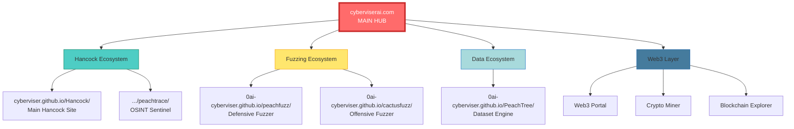

# 🌐 CYBERVISER AI ECOSYSTEM - COMPLETE WEB ARCHITECTURE

**Master Plan for Unified Web Presence + Web3 Integration**

**Date:** April 25, 2026  
**Architect:** HancockForge (0AI / CyberViser)  
**Status:** 🚀 IN DEVELOPMENT

---

## 🎯 VISION

Create a professional, interconnected web ecosystem where:
1. Each project has its own dedicated GitHub Pages site
2. All projects link together cohesively
3. cyberviserai.com serves as the main hub
4. Web3/blockchain integration provides cryptocurrency + mining capabilities
5. Professional branding consistent across all properties

---

## 📊 CURRENT STATE AUDIT

### Existing Sites (✅ Live)

| Site | URL | Status | Quality | Purpose |
|------|-----|--------|---------|---------|
| **Hancock** | https://cyberviser.github.io/Hancock/ | ✅ Live | Excellent | AI pentesting/SOC co-pilot |
| **0AI Portfolio** | https://0ai-cyberviser.github.io/0ai/ | ✅ Live | Good | Portfolio hub (3 GitHub accounts) |
| **CyberViser AI** | https://cyberviserai.com/ | ✅ Live | Good | PeachFuzz/CactusFuzz/PeachTree focus |

### Missing Sites (🔨 To Build)

| Site | Planned URL | Priority | Purpose |
|------|-------------|----------|---------|
| **PeachTree** | https://0ai-cyberviser.github.io/PeachTree/ | HIGH | Dataset orchestrator showcase |
| **PeachTrace** | https://cyberviser.github.io/Hancock/peachtrace/ | HIGH | OSINT Prime Sentinel landing |
| **CactusFuzz** | https://0ai-cyberviser.github.io/cactusfuzz/ | MEDIUM | Red team fuzzer site |
| **PeachFuzz** | https://0ai-cyberviser.github.io/peachfuzz/ | MEDIUM | Blue team fuzzer site |

---

## 🏛️ SITE HIERARCHY & STRUCTURE



---

## 🎨 DESIGN SYSTEM

### Brand Colors

```css
/* Primary Palette */
--cyber-red: #ff6b6b;        /* Main CTA, alerts */
--cyber-blue: #4ecdc4;       /* Secondary actions */
--cyber-green: #51cf66;      /* Success, live status */
--cyber-yellow: #ffe66d;     /* Warnings, highlights */
--cyber-purple: #a388ee;     /* Premium features */

/* Neutrals */
--dark-bg: #1a1a2e;          /* Main background */
--dark-card: #16213e;        /* Card backgrounds */
--dark-text: #e4e4e7;        /* Body text */
--dark-muted: #94a3b8;       /* Muted text */

/* Accents */
--accent-neon: #00ff41;      /* Matrix green for terminals */
--accent-warn: #fb8500;      /* Warning states */
```

### Typography

- **Headers:** `'Fira Code', 'JetBrains Mono', monospace` (hacker aesthetic)
- **Body:** `'Inter', 'Segoe UI', system-ui` (readability)
- **Code:** `'Fira Code', 'Source Code Pro', monospace`

### Component Library

- Hero sections with animated terminals
- Card-based feature grids
- Syntax-highlighted code blocks
- Animated status badges (🔵 LIVE, ⚡ ACTIVE, 📋 PLANNED)
- Mermaid diagram integration
- Responsive navigation with project switcher

---

## 📄 INDIVIDUAL SITE SPECIFICATIONS

### 1. PeachTree (Dataset Orchestrator)

**URL:** `https://0ai-cyberviser.github.io/PeachTree/`  
**GitHub Repo:** `https://github.com/0ai-Cyberviser/PeachTree`

**Sections:**
- **Hero:** "The Recursive Learning Engine for AI Security"
- **Features:** Quality control, deduplication, provenance, JSONL export
- **Workflow Diagram:** Repo ingestion → Processing → Dataset export
- **Integration:** Shows connection to Hancock, PeachFuzz, CactusFuzz
- **Quick Start:** Installation + first dataset generation
- **API Reference:** CLI commands + Python API
- **Examples:** Real dataset examples with stats
- **GitHub Link:** Direct link to repo

**Key Metrics to Display:**
- Datasets generated
- Total samples processed
- Deduplication rate
- Supported input formats

---

### 2. PeachTrace (OSINT Prime Sentinel)

**URL:** `https://cyberviser.github.io/Hancock/peachtrace/`  
**GitHub Repo:** `https://github.com/cyberviser/Hancock` (subfolder)

**Sections:**
- **Hero:** "OSINT Prime Sentinel v9.10 - Hive-Mind Intelligence"
- **Capabilities:** 6-phase recon workflow visualization
- **Tools:** Kali tool integration (theHarvester, Amass, RustScan, etc.)
- **Speed Benchmarks:** 400x faster than human teams
- **Authorization:** Strict ethics + authorization requirements
- **Sample Reports:** Example markdown reports with redacted data
- **Quick Start:** Installation + first scan
- **Integration:** Shows PeachTree dataset export + Hancock agent mode
- **GitHub Link:** Main Hancock repo

**Key Metrics to Display:**
- Average scan time
- Subdomains discovered per scan
- Kali tools integrated
- Report sections generated

---

### 3. CactusFuzz (Red Team Offensive Fuzzer)

**URL:** `https://0ai-cyberviser.github.io/cactusfuzz/`  
**GitHub Repo:** `https://github.com/0ai-Cyberviser/peachfuzz` (subfolder)

**Sections:**
- **Hero:** "🌵 Authorized Lab Fuzzing for Red Teams"
- **Features:** Scope-gated, simulation-first, proposal-only
- **Attack Types:** 8 generators (injection, traversal, overflow, etc.)
- **Guardrails:** Authorization checks, scope validation, safety policies
- **Use Cases:** Authorized pentests, lab environments, research
- **Mutation Strategies:** 8 strategies with examples
- **Quick Start:** Installation + first authorized fuzzing session
- **Ethics:** Clear authorization requirements
- **Integration:** PeachTree dataset export + Hancock integration
- **GitHub Link:** PeachFuzz repo (monorepo structure)

**Key Metrics to Display:**
- Attack vectors supported
- Mutation strategies
- Crash discovery rate
- Lab environment templates

---

### 4. PeachFuzz (Blue Team Defensive Fuzzer)

**URL:** `https://0ai-cyberviser.github.io/peachfuzz/`  
**GitHub Repo:** `https://github.com/0ai-Cyberviser/peachfuzz`

**Sections:**
- **Hero:** "🍑 Defensive Fuzzing for CI/CD & Parser Safety"
- **Features:** Deterministic, reproducible, CI-safe, local-only
- **Backends:** PeachTrace (coverage), Atheris (native), libFuzzer
- **Targets:** JSON, OpenAPI, GraphQL, webhooks, parsers
- **CI Integration:** GitHub Actions, GitLab CI, Jenkins examples
- **Crash Minimization:** Automated payload reduction
- **Regression Tests:** Auto-generated pytest reproducers
- **Quick Start:** Installation + first CI fuzzing run
- **Integration:** PeachTree dataset generation
- **GitHub Link:** PeachFuzz repo

**Key Metrics to Display:**
- Crashes detected
- CI/CD integrations
- Supported targets
- Minimization rate

---

## 🌐 CYBERVISERAI.COM - MAIN HUB REDESIGN

**URL:** `https://cyberviserai.com/`  
**Purpose:** Unified landing page + Web3 integration hub

### New Structure

```
cyberviserai.com/
├── index.html              # Main landing page
├── ecosystem/              # All projects overview
│   ├── hancock.html        # Hancock ecosystem page
│   ├── fuzzing.html        # Fuzzing ecosystem page
│   └── data.html           # Data ecosystem page
├── web3/                   # Web3 integration
│   ├── portal.html         # Web3 portal landing
│   ├── miner.html          # Crypto miner interface
│   ├── blockchain.html     # Blockchain explorer
│   └── wallet.html         # Wallet integration
├── docs/                   # Unified documentation
│   ├── getting-started.html
│   ├── api-reference.html
│   └── tutorials.html
├── blog/                   # Company blog
│   └── posts/
├── about/                  # About CyberViser / 0AI
│   ├── team.html
│   ├── mission.html
│   └── contact.html
└── assets/                 # Shared assets
    ├── css/
    ├── js/
    └── img/
```

### Main Landing Page Sections

1. **Hero Section**
   - "CyberViser AI - The Complete Cybersecurity Intelligence Ecosystem"
   - Animated terminal showing live system status
   - Primary CTA: "Explore Ecosystem" → /ecosystem/
   - Secondary CTA: "Web3 Portal" → /web3/portal.html

2. **Ecosystem Overview (3 Pillars)**
   - **Hancock Ecosystem** (AI Pentesting + SOC + OSINT)
     - Hancock AI Co-Pilot
     - PeachTrace OSINT Sentinel
   - **Fuzzing Ecosystem** (Offensive + Defensive)
     - PeachFuzz (Blue Team)
     - CactusFuzz (Red Team)
   - **Data Ecosystem** (Training + Evaluation)
     - PeachTree Dataset Engine

3. **Live Metrics Dashboard**
   - Real-time GitHub activity
   - Total datasets generated
   - OSINT scans completed
   - Fuzzing crashes discovered
   - Web3 mining status

4. **Quick Start Paths**
   - For Security Researchers
   - For SOC Analysts
   - For Red Teams
   - For Data Scientists
   - For Blockchain Developers

5. **Web3 Integration**
   - Cryptocurrency info
   - Mining dashboard link
   - Blockchain explorer
   - Wallet connection

6. **GitHub Integration**
   - Links to all repos
   - Contribution guidelines
   - Security reporting
   - Support channels

7. **Footer**
   - Links to all individual project sites
   - Social media
   - Legal (Terms, Privacy, Security Policy)
   - Contact info

---

## 🔗 CROSS-LINKING STRATEGY

### Navigation Structure

Every site includes a **project switcher** in the header:

```
[CyberViser AI ▼]
├── 🏠 Main Hub (cyberviserai.com)
├── 🤖 Hancock (cyberviser.github.io/Hancock/)
│   └── 🍑 PeachTrace (.../peachtrace/)
├── 🌳 PeachTree (0ai-cyberviser.github.io/PeachTree/)
├── 🍑 PeachFuzz (0ai-cyberviser.github.io/peachfuzz/)
├── 🌵 CactusFuzz (0ai-cyberviser.github.io/cactusfuzz/)
├── 🌐 Web3 Portal (cyberviserai.com/web3/)
└── 📚 Docs (cyberviserai.com/docs/)
```

### Footer Links (Standard Across All Sites)

```html
<footer class="cyber-footer">
  <div class="footer-section">
    <h4>Projects</h4>
    <ul>
      <li><a href="https://cyberviser.github.io/Hancock/">Hancock</a></li>
      <li><a href="https://cyberviser.github.io/Hancock/peachtrace/">PeachTrace</a></li>
      <li><a href="https://0ai-cyberviser.github.io/PeachTree/">PeachTree</a></li>
      <li><a href="https://0ai-cyberviser.github.io/peachfuzz/">PeachFuzz</a></li>
      <li><a href="https://0ai-cyberviser.github.io/cactusfuzz/">CactusFuzz</a></li>
    </ul>
  </div>
  <div class="footer-section">
    <h4>Company</h4>
    <ul>
      <li><a href="https://cyberviserai.com/">Main Hub</a></li>
      <li><a href="https://cyberviserai.com/about/">About</a></li>
      <li><a href="https://cyberviserai.com/blog/">Blog</a></li>
      <li><a href="https://cyberviserai.com/web3/">Web3 Portal</a></li>
    </ul>
  </div>
  <div class="footer-section">
    <h4>GitHub</h4>
    <ul>
      <li><a href="https://github.com/0ai-Cyberviser">0ai-Cyberviser</a></li>
      <li><a href="https://github.com/cyberviser">cyberviser</a></li>
      <li><a href="https://github.com/cyberviser-dotcom">cyberviser-dotcom</a></li>
    </ul>
  </div>
  <div class="footer-section">
    <h4>Support</h4>
    <ul>
      <li><a href="mailto:0ai@cyberviserai.com">Contact</a></li>
      <li><a href="https://github.com/cyberviser/Hancock/security">Security</a></li>
      <li><a href="https://cyberviserai.com/docs/">Documentation</a></li>
    </ul>
  </div>
</footer>
```

---

## 🔐 WEB3 INTEGRATION ARCHITECTURE

### Technology Stack

**Frontend:**
- Web3.js or Ethers.js for Ethereum interaction
- MetaMask integration for wallet connection
- React or Vue.js for dynamic UI

**Backend:**
- Node.js API for blockchain interactions
- WebSocket for real-time mining updates
- IPFS for decentralized storage

**Blockchain:**
- Ethereum-compatible chain (Polygon, BSC, or custom)
- Smart contracts for:
  - Token issuance (CyberViser token - CVT?)
  - Mining rewards
  - Governance voting
  - Payment processing

### Web3 Portal Features

1. **Wallet Connection**
   - MetaMask integration
   - WalletConnect support
   - Account balance display

2. **Cryptocurrency Dashboard**
   - CVT token info (supply, price, market cap)
   - Transaction history
   - Send/receive functionality

3. **Crypto Miner**
   - Browser-based mining interface
   - Mining pool statistics
   - Earnings tracker
   - Hardware stats (hashrate, temperature)

4. **Blockchain Explorer**
   - Transaction lookup
   - Block explorer
   - Smart contract verification
   - Wallet address lookup

5. **Governance Portal**
   - Proposal voting (for future features)
   - Token staking
   - Community governance

### Security Considerations

- ✅ Never store private keys on server
- ✅ All transactions require user confirmation
- ✅ Rate limiting on API endpoints
- ✅ HTTPS/TLS everywhere
- ✅ Smart contract audits before deployment
- ✅ Testnet deployment first

---

## 📋 IMPLEMENTATION ROADMAP

### Phase 1: Individual Project Sites (Week 1-2)

**Priority Order:**
1. ✅ PeachTrace landing page (highest visibility)
2. ✅ PeachTree site (dataset engine showcase)
3. ✅ CactusFuzz site (red team fuzzer)
4. ✅ PeachFuzz site (blue team fuzzer)

**Deliverables per site:**
- Complete HTML/CSS/JS site
- README.md with deployment instructions
- GitHub Pages configuration
- Cross-linking to other projects

### Phase 2: Enhanced cyberviserai.com Hub (Week 3)

**Tasks:**
1. Redesign main landing page
2. Create ecosystem overview pages
3. Build unified documentation portal
4. Implement live metrics dashboard
5. Add blog infrastructure
6. Update footer/navigation across all sites

**Deliverables:**
- New cyberviserai.com design
- Unified navigation components
- Metrics API backend (GitHub stats, etc.)
- Documentation portal

### Phase 3: Web3 Integration (Week 4-6)

**Tasks:**
1. Design Web3 portal UI
2. Implement wallet connection
3. Create cryptocurrency dashboard
4. Build browser-based miner prototype
5. Develop blockchain explorer
6. Deploy smart contracts to testnet

**Deliverables:**
- Functional Web3 portal
- MetaMask integration
- Mining interface (prototype)
- Blockchain explorer
- Smart contracts on testnet

### Phase 4: Production Launch & Polish (Week 7-8)

**Tasks:**
1. Security audits across all sites
2. Performance optimization
3. SEO optimization
4. Analytics integration (privacy-respecting)
5. Final cross-linking verification
6. Marketing materials (screenshots, videos)
7. Launch announcements

**Deliverables:**
- All sites production-ready
- Security audit reports
- Performance reports (Lighthouse scores 90+)
- SEO optimization complete
- Launch blog post + social media

---

## 📊 SUCCESS METRICS

### Traffic & Engagement

- **Target:** 1,000 unique visitors/month per site (first 3 months)
- **GitHub Stars:** 500+ across all repos (6 months)
- **Documentation Views:** 5,000+ page views/month

### Technical Metrics

- **Lighthouse Scores:** 90+ across all sites (Performance, SEO, Accessibility)
- **Page Load Time:** < 2 seconds (desktop), < 3 seconds (mobile)
- **Uptime:** 99.9% (GitHub Pages SLA)

### Web3 Metrics (Post-Launch)

- **Wallet Connections:** 100+ unique wallets (first month)
- **Mining Participants:** 50+ active miners
- **Token Holders:** 500+ CVT holders (6 months)
- **Governance Participation:** 25% of token holders voting

---

## 🛠️ TECHNICAL STACK SUMMARY

### Frontend
- HTML5, CSS3, JavaScript (ES6+)
- Optional: React/Vue.js for complex interactions
- Tailwind CSS or custom CSS framework
- Mermaid.js for diagrams
- Highlight.js for code syntax
- Web3.js/Ethers.js for blockchain

### Build Tools
- No build step required for static sites (pure HTML/CSS/JS)
- Optional: Vite or Webpack for advanced features
- GitHub Actions for automated deployment

### Hosting
- **GitHub Pages:** All project sites (free, reliable)
- **Custom Domain:** cyberviserai.com (already owned)
- **IPFS:** Optional decentralized hosting for Web3 portal

### Backend (Web3 API)
- Node.js + Express
- WebSocket for real-time updates
- MongoDB or PostgreSQL for data
- Redis for caching
- Docker deployment

---

## 🎬 NEXT STEPS

### Immediate Actions (This Week)

1. ✅ Create PeachTrace landing page HTML
2. ✅ Create PeachTree landing page HTML
3. ✅ Create CactusFuzz landing page HTML
4. ✅ Create PeachFuzz landing page HTML
5. ✅ Design unified CSS framework
6. ✅ Create shared navigation component
7. ✅ Test deployment to GitHub Pages

### Short-Term (Next Week)

1. ⏳ Enhance cyberviserai.com landing page
2. ⏳ Build metrics dashboard API
3. ⏳ Create documentation portal
4. ⏳ Implement project switcher navigation
5. ⏳ Add blog infrastructure

### Medium-Term (Month 2)

1. ⏳ Design Web3 portal UI/UX
2. ⏳ Implement MetaMask integration
3. ⏳ Prototype crypto miner interface
4. ⏳ Deploy smart contracts to testnet
5. ⏳ Build blockchain explorer

---

## 📚 RESOURCES & REFERENCES

### Design Inspiration
- **GitHub Pages:** https://pages.github.com/
- **Vercel:** https://vercel.com/ (for sleek landing pages)
- **Stripe:** https://stripe.com/ (for professional dev docs)
- **Tailwind UI:** https://tailwindui.com/ (component examples)

### Web3 Resources
- **Web3.js Docs:** https://web3js.readthedocs.io/
- **Ethers.js Docs:** https://docs.ethers.org/
- **MetaMask Docs:** https://docs.metamask.io/
- **OpenZeppelin Contracts:** https://docs.openzeppelin.com/contracts/

### Testing Tools
- **Lighthouse:** https://developers.google.com/web/tools/lighthouse
- **WebPageTest:** https://www.webpagetest.org/
- **WAVE Accessibility:** https://wave.webaim.org/

---

## 🏆 FINAL VISION

**A cohesive, professional web presence where:**

✅ Every project has a beautiful, dedicated landing page  
✅ All sites feel like part of the same ecosystem  
✅ Navigation between projects is seamless  
✅ cyberviserai.com serves as the authoritative hub  
✅ Web3 integration provides innovative blockchain features  
✅ Documentation is comprehensive and accessible  
✅ GitHub repos are the single source of truth  
✅ The entire ecosystem showcases technical excellence  

**Result:** A portfolio that demonstrates world-class cybersecurity AI capabilities backed by professional infrastructure and cutting-edge Web3 integration.

---

**🍑 Ready to build the complete CyberViser AI Ecosystem, one site at a time.**

**Built by:** HancockForge (Johnny Watters / 0AI / CyberViser)  
**Date:** April 25, 2026  
**Status:** 🚀 ARCHITECTURE COMPLETE - READY FOR IMPLEMENTATION  

**Next:** Start building PeachTrace landing page → PeachTree → CactusFuzz → PeachFuzz → Enhanced cyberviserai.com → Web3 Portal

