# 🗺️ CYBERVISER AI ECOSYSTEM MAP

**Complete Visual Architecture - April 25, 2026**

---

## 🌐 COMPLETE WEB ECOSYSTEM

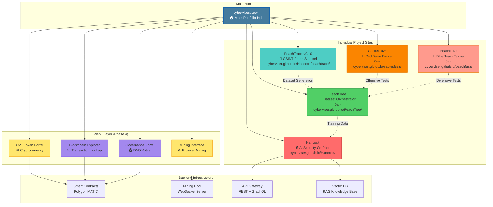

---

## 📊 SITE HIERARCHY

```
cyberviserai.com (Main Hub)
├── hancock
│   └── peachtrace/
├── Individual Project Sites
│   ├── PeachTree (0ai-cyberviser.github.io/PeachTree/)
│   ├── CactusFuzz (0ai-cyberviser.github.io/cactusfuzz/)
│   └── PeachFuzz (0ai-cyberviser.github.io/peachfuzz/)
├── Documentation Hub
│   ├── hancock/
│   ├── peachtrace/
│   ├── peachtree/
│   └── peachfuzz/
└── Web3 Portal (Phase 4)
    ├── Cryptocurrency (CVT Token)
    ├── Mining Dashboard
    ├── Blockchain Explorer
    └── Governance Portal
```

---

## 🔄 DATA FLOW ARCHITECTURE

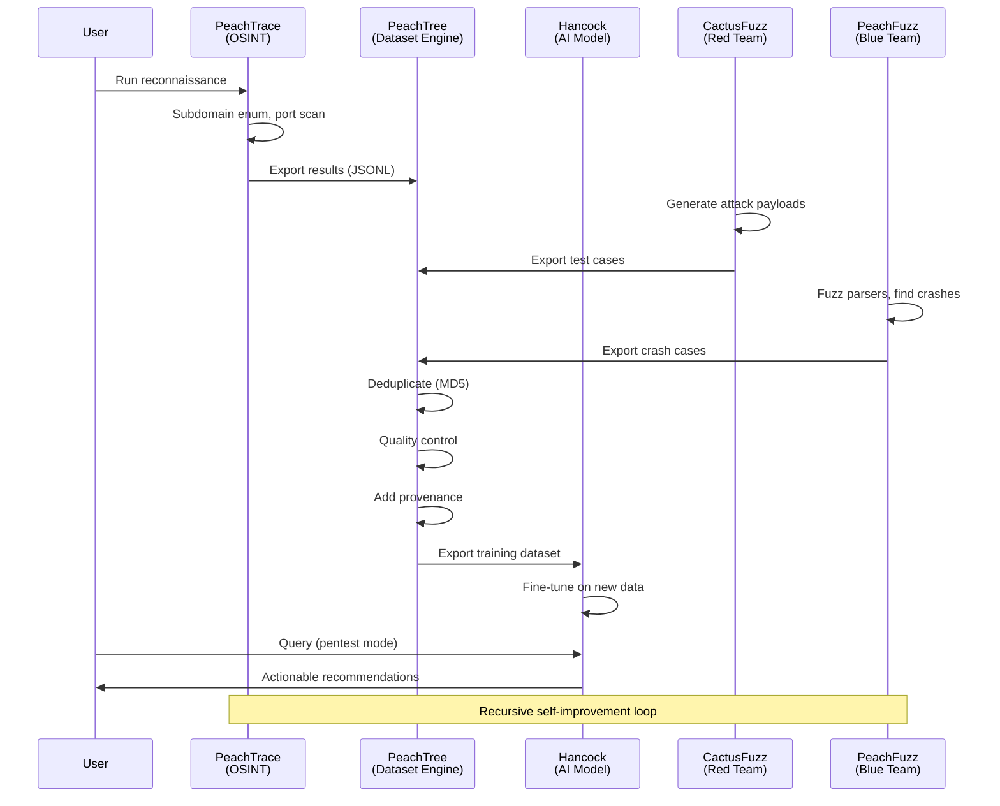

---

## 🪙 WEB3 INTEGRATION ARCHITECTURE

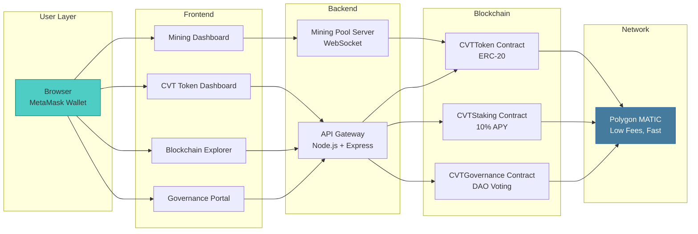

---

## 🎨 DESIGN SYSTEM OVERVIEW

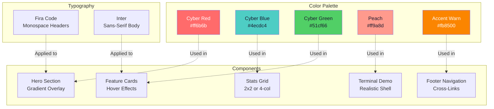

---

## 🚀 DEPLOYMENT TIMELINE

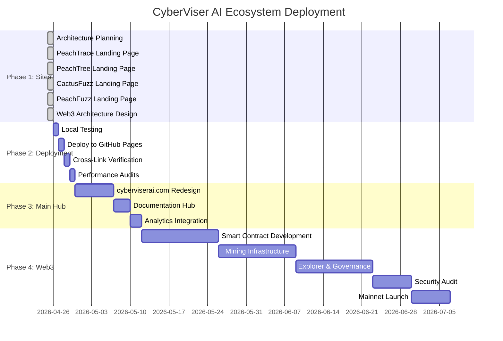

---

## 📊 TRAFFIC FLOW (POST-DEPLOYMENT)

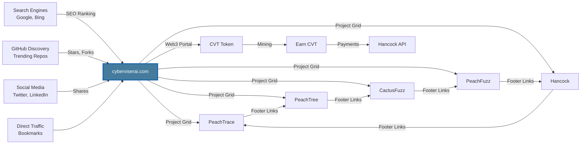

---

## 🎯 USER JOURNEY MAP

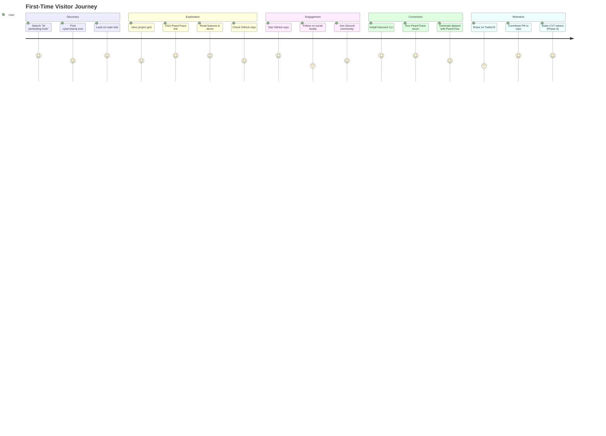

---

## 🛠️ TECHNICAL STACK

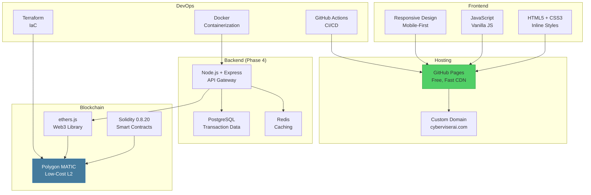

---

## 🔒 SECURITY ARCHITECTURE

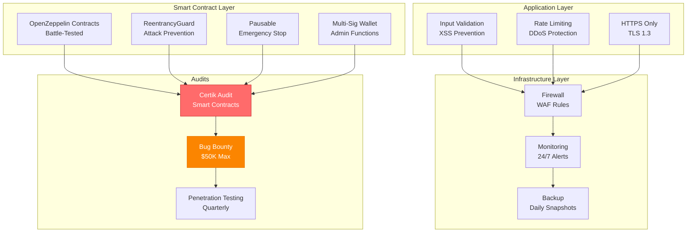

---

## 📈 GROWTH STRATEGY

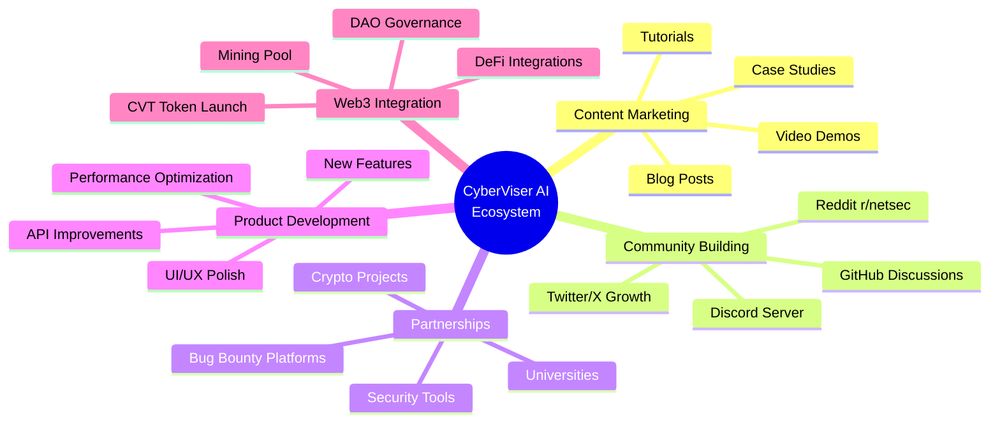

---

## 🎯 SUCCESS METRICS DASHBOARD

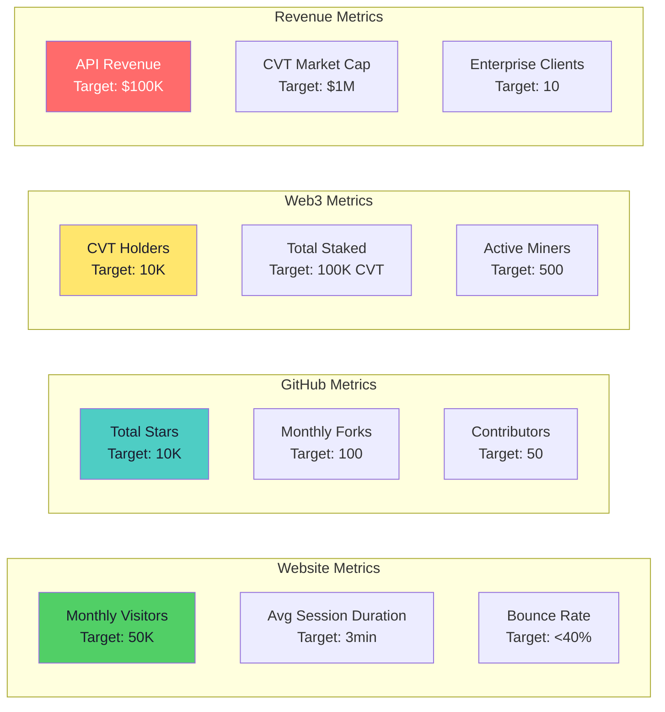

---

## 🔗 QUICK REFERENCE

### Live URLs (After Deployment)

| Project | URL | Status |
|---------|-----|--------|
| **PeachTrace** | https://cyberviser.github.io/Hancock/peachtrace/ | 🟡 Pending Deploy |
| **PeachTree** | https://0ai-cyberviser.github.io/PeachTree/ | 🟡 Pending Deploy |
| **CactusFuzz** | https://0ai-cyberviser.github.io/cactusfuzz/ | 🟡 Pending Deploy |
| **PeachFuzz** | https://0ai-cyberviser.github.io/peachfuzz/ | 🟡 Pending Deploy |
| **Hancock** | https://cyberviser.github.io/Hancock/ | 🟢 Live |
| **Main Hub** | https://cyberviserai.com | 🟡 Pending Redesign |

### GitHub Repositories

| Project | Repository | Stars |
|---------|-----------|-------|
| **Hancock** | https://github.com/cyberviser/Hancock | ~100 |
| **PeachTree** | https://github.com/0ai-Cyberviser/PeachTree | ~10 |
| **PeachFuzz** | https://github.com/0ai-Cyberviser/peachfuzz | ~20 |

### Key Documents

| Document | Location | Purpose |
|----------|----------|---------|
| **Delivery Summary** | WEB_ECOSYSTEM_DELIVERY.md | Master overview |
| **Architecture Plan** | WEB_ECOSYSTEM_ARCHITECTURE.md | Detailed design |
| **Web3 Specs** | WEB3_INTEGRATION_ARCHITECTURE.md | Crypto/blockchain |
| **Deployment Guide** | GITHUB_PAGES_DEPLOYMENT.md | Step-by-step deploy |
| **Ecosystem Map** | WEB_ECOSYSTEM_MAP.md | This file |

---

## 📞 NEXT ACTIONS

### ⚡ IMMEDIATE (TODAY)

1. **Review all delivered files**
   - WEB_ECOSYSTEM_DELIVERY.md (master summary)
   - docs/peachtrace/index.html
   - docs/peachtree/index.html
   - docs/cactusfuzz/index.html
   - docs/peachfuzz/index.html

2. **Test locally**
   ```bash
   cd /home/_0ai_/Hancock-1
   python3 -m http.server 8000 --directory docs/peachtrace
   # Open http://localhost:8000
   ```

3. **Review Web3 architecture**
   - WEB3_INTEGRATION_ARCHITECTURE.md
   - Decide on testnet launch timeline

### 🚀 THIS WEEK

1. **Deploy all 4 sites to GitHub Pages**
   - Follow GITHUB_PAGES_DEPLOYMENT.md
   - Enable GitHub Pages in repo settings
   - Verify all URLs live

2. **Update social media**
   - Announce new project sites
   - Share screenshots
   - Link to GitHub repos

3. **Update GitHub READMEs**
   - Add links to new landing pages
   - Update project descriptions
   - Add badges and stats

### 📅 NEXT 2 WEEKS

1. **Redesign cyberviserai.com**
   - Create main hub landing page
   - Add project grid
   - Build documentation hub

2. **Analytics setup**
   - Add Plausible or Google Analytics
   - Track visitor metrics
   - Monitor performance

3. **SEO optimization**
   - Submit to search engines
   - Optimize meta tags
   - Build backlinks

---

**🗺️ Your complete ecosystem map is ready!**

**Next:** Deploy to GitHub Pages → Enhance cyberviserai.com → Launch Web3 integration

**Built by:** HancockForge (Johnny Watters / 0AI / CyberViser)  
**Date:** April 25, 2026  
**Status:** 🎉 **READY TO LAUNCH!**
