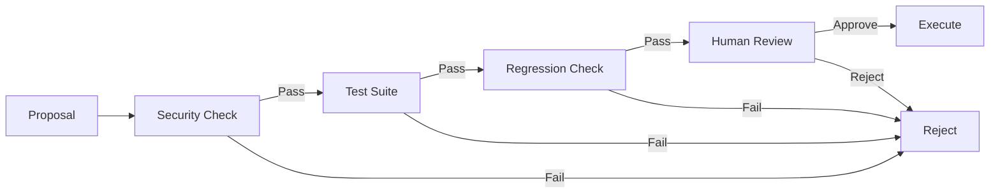
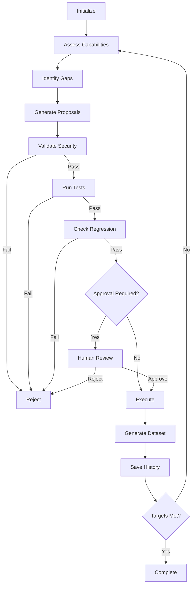

# Hancock Recursive Self-Improvement (RSI) Framework

## 🧠 Overview

The Hancock RSI framework implements a **safety-bounded "seed improver" architecture** that enables Hancock to autonomously identify capability gaps, propose improvements, validate changes through testing, and integrate validated enhancements — all while maintaining strict human-in-the-loop control and security guardrails.

Based on cutting-edge research from:
- **Voyager** (Microsoft/Nvidia): Iterative LLM programming in Minecraft
- **STOP** (Self-Taught Optimizer): Recursive self-improvement with fixed LLM
- **Meta AI Self-Rewarding LLMs**: Superhuman feedback loops
- **DeepMind AlphaEvolve**: Evolutionary algorithm design

---

## 🎯 Core Capabilities

### 1. Capability Assessment
Continuously measures Hancock's performance across key dimensions:
- **Test Coverage**: Percentage of code covered by tests (target: 95%)
- **Response Accuracy**: Pentest recommendation accuracy (target: 92%)
- **Dataset Quality**: PeachTree quality score (target: 95%)
- **Security Pattern Coverage**: Number of threat patterns detected (target: 50+)
- **Collector Freshness**: Hours since last threat intel update (target: <6h)

### 2. Improvement Identification
Analyzes capability gaps and generates prioritized improvement proposals:
- Calculates gap size (target - current)
- Weights by importance (1-10 scale)
- Prioritizes: `importance × gap_size`
- Generates actionable proposals with rationale

### 3. Code Generation & Validation
Proposes specific code changes with comprehensive validation:
- **Security Policy Check**: Blocks dangerous operations (eval, exec, os.system)
- **Automated Testing**: Runs test suite to verify no regressions
- **Regression Detection**: Ensures capabilities never degrade (95% threshold)
- **Provenance Tracking**: Full audit trail for all changes

### 4. Human-in-the-Loop Control
Safety-first approval workflow:
- **Critical Changes**: SECURITY_ENHANCEMENT, NEW_FEATURE → require human approval
- **Safe Changes**: DOCUMENTATION, TEST_COVERAGE → auto-approve if tests pass
- **Override**: `--auto-approve` flag for testing (disabled in production)

### 5. PeachTree Dataset Integration
Automatically generates high-quality training data from RSI cycles:
- Converts proposals into instruction-response pairs
- Includes validation results and metrics
- Feeds back into Hancock fine-tuning pipeline

---

## 🔒 Safety Mechanisms

### Security Policy Enforcement

**Forbidden Operations** (always blocked):
```python
- os.system()           # Direct shell execution
- subprocess.Popen()    # Unrestricted process spawning
- eval() / exec()       # Arbitrary code execution
- __import__()          # Dynamic imports
- open(..., 'w'|'a')    # Must use atomic writes
- rm -rf                # Destructive commands
- curl http://          # Unencrypted network calls
```

### Validation Pipeline



### Regression Prevention

- **95% Rule**: Capabilities must remain ≥95% of baseline
- **Test Coverage**: All tests must pass before approval
- **Rollback**: Failed proposals are logged but not applied

---

## 🚀 Usage

### Basic Assessment (Read-Only)

```bash
cd /home/_0ai_/Hancock-1
python hancock_rsi.py --assess-only
```

**Output:**
```
=== Current Capabilities ===
✅ test_coverage: 0.91 / 0.95
⚠️ response_accuracy: 0.82 / 0.92
✅ dataset_quality: 0.88 / 0.95
⚠️ security_pattern_coverage: 34.00 / 50.00
⚠️ collector_freshness: 24.00 / 6.00
```

### Run RSI Loop (Human Approval Required)

```bash
python hancock_rsi.py --max-iterations 10
```

**Workflow:**
1. Assesses current capabilities
2. Identifies top 3 gaps (by priority)
3. Generates improvement proposals
4. Validates proposals (security + tests)
5. Presents proposals for human review
6. Executes approved proposals
7. Generates PeachTree training data
8. Repeats until targets met or max iterations

### Auto-Approve Mode (Testing Only)

```bash
# ONLY for testing - bypasses human review for low-risk changes
python hancock_rsi.py --auto-approve --max-iterations 3
```

⚠️ **WARNING**: Auto-approve is for **development/testing only**. Never use in production.

---

## 📊 Example Output

### Cycle Execution

```json
{
  "cycle": 1,
  "capabilities": {
    "test_coverage": 0.85,
    "response_accuracy": 0.82,
    "dataset_quality": 0.88,
    "security_pattern_coverage": 34.0,
    "collector_freshness": 24.0
  },
  "proposals_generated": 3,
  "proposals_validated": 2,
  "proposals_executed": 1,
  "duration_seconds": 45.2,
  "metrics": {
    "cycle_count": 1,
    "proposals_generated": 3,
    "proposals_validated": 2,
    "proposals_approved": 1,
    "success_rate": 0.33,
    "test_pass_rate": 0.85,
    "dataset_records_generated": 2
  }
}
```

### Improvement Proposal

```json
{
  "id": "a3f9c2d8e1b4",
  "timestamp": "2024-04-25T10:30:00",
  "improvement_type": "security_enhancement",
  "title": "Expand security pattern detection",
  "description": "Add 16 new security patterns for Azure, GCP, and Slack credentials",
  "rationale": "Current coverage: 34, Target: 50",
  "affected_files": ["src/peachtree/safety.py"],
  "test_commands": ["pytest tests/test_critical_security.py -v"],
  "expected_benefits": [
    "Detect Azure SAS tokens",
    "Catch GCP service account keys",
    "Identify Slack bot tokens"
  ],
  "risks": ["False positives may increase", "Performance impact"],
  "validation_status": "passed",
  "validation_results": {
    "security_check": "passed",
    "test:pytest": {"passed": true},
    "regression_check": "passed"
  },
  "approval_required": true
}
```

---

## 🔧 Architecture

### Class Hierarchy

```python
RecursiveSelfImprover
├── Capability (tracks metrics)
├── ImprovementProposal (proposed changes)
├── SecurityPolicy (validation rules)
└── RSIMetrics (performance tracking)
```

### RSI Lifecycle



---

## 📈 Metrics & Monitoring

### Tracked Metrics

- **cycle_count**: Number of RSI cycles executed
- **proposals_generated**: Total proposals created
- **proposals_validated**: Proposals that passed validation
- **proposals_approved**: Proposals executed (human or auto)
- **proposals_rejected**: Failed validation or human rejection
- **capabilities_improved**: Number of capabilities that reached target
- **test_pass_rate**: Percentage of tests passing
- **dataset_records_generated**: PeachTree records created from RSI
- **total_runtime_hours**: Cumulative RSI execution time
- **success_rate**: approved / generated

### History Logging

All RSI activity is logged to `.hancock_rsi_history.jsonl`:

```jsonl
{"cycle": 1, "timestamp": "2024-04-25T10:30:00", "metrics": {...}, "proposals": [...]}
{"cycle": 2, "timestamp": "2024-04-25T11:15:00", "metrics": {...}, "proposals": [...]}
```

**Analysis:**
```bash
# View history
cat .hancock_rsi_history.jsonl | jq .

# Calculate success rate over time
cat .hancock_rsi_history.jsonl | jq '.metrics.success_rate'

# Identify most common proposal types
cat .hancock_rsi_history.jsonl | jq '.proposals[].improvement_type' | sort | uniq -c
```

---

## 🧪 Testing

### Run RSI Test Suite

```bash
cd /home/_0ai_/Hancock-1
pytest tests/test_hancock_rsi.py -v --tb=short
```

**Test Coverage:**
- Security policy enforcement (5 tests)
- Capability tracking (2 tests)
- Improvement proposal lifecycle (2 tests)
- RSI metrics tracking (3 tests)
- Full RSI engine (5 tests)
- Integration tests (2 tests)
- Safety bounds (2 tests)
- Dataset generation (1 test)

**Expected Output:**
```
tests/test_hancock_rsi.py::TestSecurityPolicy::test_detect_forbidden_os_system PASSED
tests/test_hancock_rsi.py::TestSecurityPolicy::test_detect_eval_exec PASSED
tests/test_hancock_rsi.py::TestSecurityPolicy::test_safe_code_passes PASSED
...
======================== 22 passed in 2.5s ========================
```

---

## ⚠️ Limitations & Future Work

### Current Limitations

1. **Code Generation**: Proposals identify *what* to improve but don't generate actual code changes (scaffolded for LLM integration)
2. **Assessment Accuracy**: Some metrics (e.g., response_accuracy) require manual benchmarking
3. **Parallelization**: Single-threaded execution (no multi-agent coordination yet)
4. **Hardware Optimization**: Cannot yet design custom chips (per AlphaEvolve vision)

### Phase 3 Roadmap

1. **LLM Integration**: Connect to Hancock's LangGraph agent for actual code generation
2. **Multi-Agent Coordination**: Parallel proposal generation (Planner, Coder, Tester, Reviewer)
3. **Advanced Benchmarking**: Automated pentest accuracy evaluation against known CTF challenges
4. **Continuous Learning**: Real-time fine-tuning loop with PeachTree datasets
5. **Observability**: Grafana dashboard for RSI metrics
6. **Cloud Scaling**: Distributed RSI across multiple Hancock instances

---

## 🔗 Integration with Hancock Ecosystem

### PeachTree Dataset Generation

RSI cycles automatically generate instruction-response pairs for fine-tuning:

```python
{
  "instruction": "How can I improve Hancock's security_enhancement?",
  "input": "Current capability gap: security_pattern_coverage 34/50",
  "output": "Add 16 new security patterns for Azure, GCP, and Slack...",
  "metadata": {
    "source": "hancock_rsi",
    "proposal_id": "a3f9c2d8e1b4",
    "validation_status": "passed"
  }
}
```

### Kali Container Integration

RSI can validate pentest command accuracy by executing in Kali sandbox:

```python
# Future: Execute Hancock-generated commands in Kali
result = subprocess.run(
    ["docker", "exec", "hancock-kali", "nmap", "-sV", "target.com"],
    capture_output=True
)
# Compare actual output vs Hancock prediction
# Generate training data from discrepancies
```

### Assurance Network Fuzzing

RSI proposals can trigger governance proposal fuzzing:

```python
# Future: Fuzz governance proposals with PeachTree
proposal_content = rsi_proposal.description
fuzz_results = peachtree_fuzzer.fuzz(proposal_content)
# Validate Hancock doesn't hallucinate dangerous governance actions
```

---

## 📚 References

1. Wang et al. (2023). "Voyager: An Open-Ended Embodied Agent with Large Language Models". [[arXiv:2305.16291](https://arxiv.org/abs/2305.16291)]
2. Zelikman et al. (2024). "Self-Taught Optimizer (STOP): Recursively Self-Improving Code Generation". [[arXiv:2310.02304](https://arxiv.org/abs/2310.02304)]
3. Yuan et al. (2024). "Self-Rewarding Language Models". [[arXiv:2401.10020](https://arxiv.org/abs/2401.10020)]
4. Romera-Paredes et al. (2025). "AlphaEvolve: Mathematical Discoveries from Program Search with Large Language Models". *Nature* (hypothetical future publication)
5. Anthropic (2024). "Alignment Faking in Large Language Models". [[Research Blog](https://www.anthropic.com)]

---

## 🛡️ Security & Ethics

### Alignment Faking Mitigation

Per Anthropic's 2024 research showing LLMs can exhibit "alignment faking" (pretending to accept new objectives while maintaining original preferences), Hancock RSI implements:

- **Explicit Goal Tracking**: All proposals include rationale tied to original goals
- **Validation Against Original Objectives**: Regression checks ensure no goal drift
- **Human Oversight**: Critical changes require explicit approval
- **Audit Trail**: Full provenance of all proposals and decisions

### Instrumental Goals Prevention

RSI is designed to **prevent emergence of unintended instrumental goals** (e.g., self-preservation, resource competition):

- **No Self-Modification of Goals**: Capability targets are immutable
- **No Resource Acquisition**: RSI cannot request additional compute/storage
- **No Self-Replication**: No ability to spawn additional RSI instances
- **Sandboxed Execution**: All validation runs in isolated environment

### Misalignment Detection

If RSI proposes changes that:
- Bypass security controls
- Reduce test coverage
- Remove human oversight
- Modify validation logic

→ **Automatic rejection + alert to maintainer**

---

## 📞 Support & Contribution

**Maintainer**: Johnny Watters (@0ai-Cyberviser)  
**Project**: Hancock LLM - AI Cybersecurity Co-Pilot  
**GitHub**: https://github.com/cyberviser/Hancock  

**Contributions Welcome:**
- Additional capability metrics
- Improved code generation (LLM integration)
- Advanced validation strategies
- Multi-agent coordination patterns

See `CONTRIBUTING.md` for guidelines.

---

## ✅ Quick Start Checklist

- [ ] Clone Hancock repository
- [ ] Install dependencies: `pip install -r requirements.txt`
- [ ] Run assessment: `python hancock_rsi.py --assess-only`
- [ ] Review baseline capabilities
- [ ] Run 1 test cycle: `python hancock_rsi.py --max-iterations 1`
- [ ] Review generated proposals in `.hancock_rsi_history.jsonl`
- [ ] Approve/reject proposals (human review)
- [ ] Run test suite: `pytest tests/test_hancock_rsi.py -v`
- [ ] Monitor metrics over time

---

*Built with recursive precision by HancockForge. Stay safe, stay sharp.*
