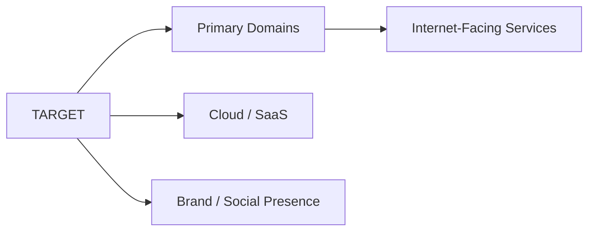
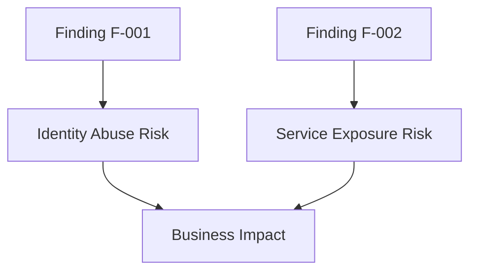
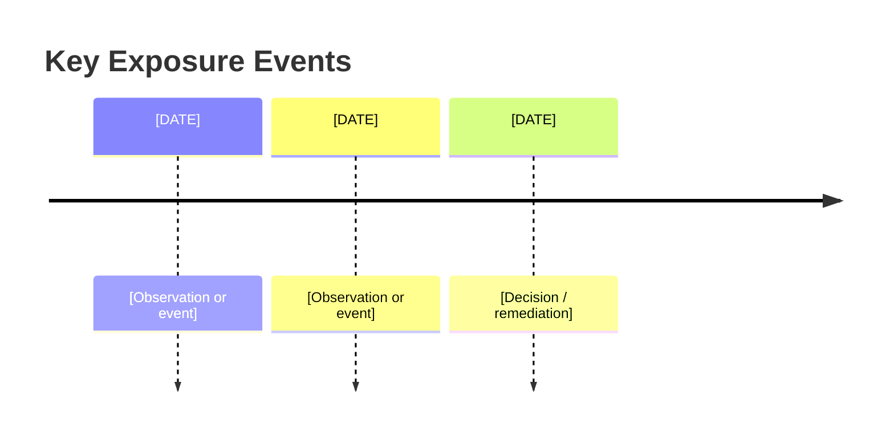

# OSINT Exposure Assessment Report

**Authorized defensive use only.** Use this template for owned assets, contracted assessments, or internal exposure-management programs. Replace bracketed placeholders and cite every claim in the appendix.

## Title Page

- **Report Title:** [TARGET] Exposure Assessment
- **Target:** [TARGET]
- **Scope:** [SCOPE]
- **Date:** [YYYY-MM-DD]
- **Classification:** UNCLASSIFIED // OSINT
- **Prepared By:** [ANALYST / TEAM]
- **Report Profile:** [CISO | SOC | Joint]
- **Authorization Reference:** [TICKET / SOW / APPROVAL ID]

## Executive Summary

[Half-page summary covering business context, overall exposure level, top three risks, and the immediate actions leadership should approve.]

- **Executive Risk Score (1-10):** [SCORE]
- **Risk Statement:** [One sentence tying exposure to business impact.]
- **Top Decisions Required:** [Decision 1], [Decision 2], [Decision 3]

## Key Findings

| ID | Finding | Severity | Confidence | Business Impact | Evidence |
| --- | --- | --- | --- | --- | --- |
| F-001 | [Finding title] | [Critical/High/Med/Low] | [0-100]% | [Impact summary] | [EVID-001] |
| F-002 | [Finding title] | [Critical/High/Med/Low] | [0-100]% | [Impact summary] | [EVID-002] |

## Infrastructure Exposure

### Asset Inventory Summary
- **Known Domains / Brands:** [List]
- **Internet-Facing Services:** [List]
- **Cloud / SaaS Dependencies:** [List]
- **Observed Defensive Gaps:** [List]

### Findings
- **Observation:** [What was found]
- **Why It Matters:** [Business / operational impact]
- **Confidence:** [0-100]% and why
- **Sources:** [EVID-IDs]

### Screenshot / Artifact Notes
- **Screenshot Description:** [What the analyst captured and why]
- **Raw Artifact Path:** [Path / object key / ticket]

### Questions for Expansion
- Which exposed assets lack a named owner?
- Which services should be moved behind stronger access controls?

## People and Identity Exposure

- **Executive / Brand Impersonation Risk:** [Summary]
- **Employee Exposure Pattern:** [Summary; avoid unnecessary PII]
- **High-Risk Identity Signals:** [Credential reuse, contact harvesting, repo leaks, etc.]
- **Sources:** [EVID-IDs]

### Questions for Expansion
- Which personas are most attractive for phishing or impersonation?
- Are there roles that need executive protection or additional monitoring?

## Digital Footprint and Public Content

- **Official Web Presence:** [Summary]
- **Unmanaged / Legacy Content:** [Summary]
- **Public Repositories / Docs / Buckets / Pages:** [Summary]
- **Contradictions or Ownership Ambiguity:** [Summary]
- **Sources:** [EVID-IDs]

### Questions for Expansion
- Which public content is business-critical but unmanaged?
- Which legacy assets create confusion about ownership or authenticity?

## Social Media and Brand Monitoring

- **Official Accounts:** [List]
- **Potentially Unofficial / Impersonating Accounts:** [Summary]
- **Fraud / Scam Indicators:** [Summary]
- **Response Owner:** [Team / function]
- **Sources:** [EVID-IDs]

### Questions for Expansion
- Which fake or abandoned accounts present the highest trust risk?
- Which takedown workflows need legal or communications support?

## Leak, Threat, and Adversary Context

- **Recent Public Incident Mentions:** [Summary]
- **Credential / Data Exposure Signals:** [Summary]
- **Threat Actor Interest Indicators:** [Summary]
- **Ransomware / Extortion Relevance:** [Summary]
- **Sources:** [EVID-IDs]

### Questions for Expansion
- Which findings require incident-response verification versus routine remediation?
- Which external mentions materially change current threat assumptions?

## Risk and Control Mapping

| Finding ID | MITRE ATT&CK | NIST / Control Mapping | Likelihood | Impact | Owner |
| --- | --- | --- | --- | --- | --- |
| F-001 | [Technique / Tactic] | [Control family / control] | [Low/Med/High] | [Low/Med/High] | [Owner] |
| F-002 | [Technique / Tactic] | [Control family / control] | [Low/Med/High] | [Low/Med/High] | [Owner] |

## Recommendations

### Immediate (0-7 Days)
- [Action with accountable owner]
- [Action with accountable owner]

### 30-Day
- [Action with accountable owner]
- [Action with accountable owner]

### Long-Term
- [Action with accountable owner]
- [Action with accountable owner]

## Visuals

### Mermaid Diagram 1: Asset Ownership Map

### Mermaid Diagram 2: Exposure-to-Impact Graph

### Mermaid Diagram 3: Exposure Timeline

## Appendix A: Evidence Register

| Evidence ID | Claim | Source | Retrieval Timestamp | Sensitivity | Notes |
| --- | --- | --- | --- | --- | --- |
| EVID-001 | [Claim] | [URL / source name] | [ISO-8601] | [Public / Internal / Sensitive] | [Notes] |
| EVID-002 | [Claim] | [URL / source name] | [ISO-8601] | [Public / Internal / Sensitive] | [Notes] |

## Appendix B: Confidence Matrix

| Confidence Band | Meaning | Handling Rule |
| --- | --- | --- |
| 90-100 | Confirmed by multiple strong sources | Can drive executive action |
| 70-89 | Likely and evidence-backed | Can drive team-level action |
| 40-69 | Plausible but incomplete | Verify before escalation |
| 0-39 | Weak / conflicting | Do not act without corroboration |

## Appendix C: Analyst Notes

- **Collection Constraints:** [What was intentionally excluded]
- **Redactions Applied:** [Summary]
- **Open Questions:** [Summary]

